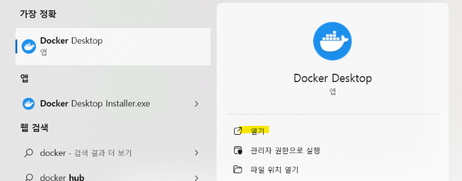
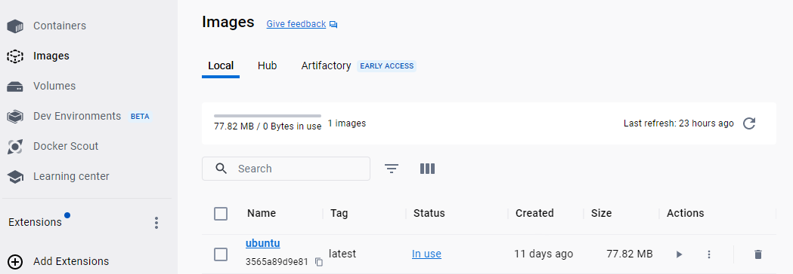

# Docker 기본명령어 
- Docker Desktop 실행(열기)

---
## search
- `docker search <이미지명>`: [Docker Hub](https://hub.docker.com/)에서 해당 이미지들을 검색할 수 있습니다.

---
## pull
- `docker pull <이미지명>:<태그>`: 이미지를 받아올 수 있습니다.

---
## images
- `docker images`: 다운로드 받은 이미지의 목록을 출력할 수 있습니다.

---
## [run](https://wooono.tistory.com/348)
- `docker run -i -t --name <컨테이너이름> ubuntu /bin/bash`
  - `-i`: 보통 이 옵션을 사용하여 Bash 에 명령을 입력합니다.
  - `-t`: Bash를 사용하려면 이 옵션을 설정해야 합니다.
  - `--name`: 컨테이너 이름을 설정합니다.

---
## ps
- `docker ps -a`: 모든 컨테이너 목록을 출력합니다.
  -  `-a`: 사용이 정지된 컨테이너까지 모두 출력 

---
## stop
- `docker stop <컨테이너 이름>`: 컨테이너 멈추기 

---
## start
- `docker start <컨테이너 이름>`: 컨테이너 실행하기 

---
## restart
- `docker restart <컨테이너 이름>`: 컨테이너 재실행하기 

---
## attach
- `docker attach hello`: 컨테이너에 접속하기 

---
## exec 
- `docker exec <컨테이너이름> echo "hello World"`: 외부에서 컨테이너에 명령하기 

---
## rm
- `docker rm <컨테이너이름>`: 컨테이너 삭제  

---
## rmi
- `docker rmi <이미지명>:<태그>`: 이미지 삭제 

