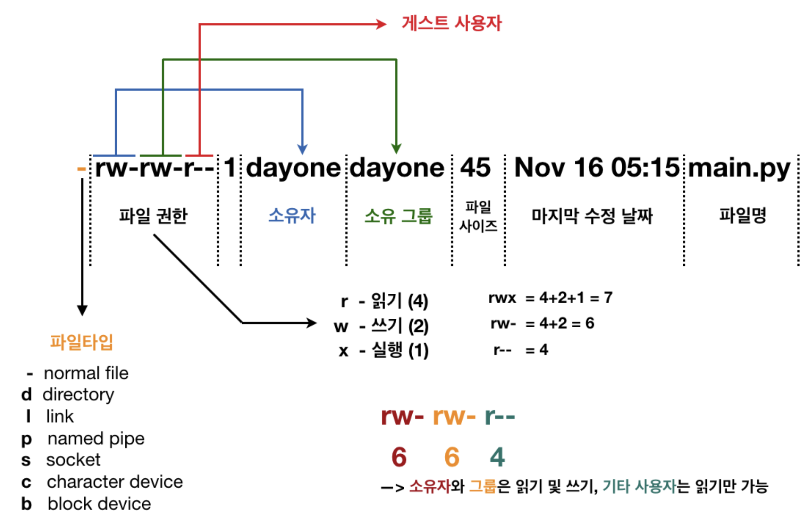

# [소유권 & 허가권](https://inpa.tistory.com/entry/LINUX-%F0%9F%93%9A-%ED%8C%8C%EC%9D%BC-%EA%B6%8C%ED%95%9C-%EC%86%8C%EC%9C%A0%EA%B6%8C%ED%97%88%EA%B0%80%EA%B6%8C-%F0%9F%92%AF-%EC%A0%95%EB%A6%AC) 
- 리눅스는 여러사용자가 들어와 사용하는 멀티유저 시스템이다. 따라서 여러 사용자가 들어와 사용하다보면, 서버에 올려진 비밀자료 열람과 그것을 변조,수정,삭제를 할 우려가 높아지게 된다.
- 이 문제를 극복하기위해 리눅스 OS에는 특별한 기능이 있는데 바로 퍼미션(권한)이라는 기능이다.
- 이 기능으로 사용자들은 자신한테 읽기 퍼미션이 부여된 파일만 읽을 수 있고, 쓰기 퍼미션이 부여된 파일만 쓰기와 수정이 가능하고, 실행 퍼미션이 부여된 파일만 실행이 가능하게 된다. 
  - 그리고 열람 권한 뿐만 아니라 파일 소유자 개념도 지원해준다.

---

---
# 참고문서 
- https://inpa.tistory.com/entry/LINUX-%F0%9F%93%9A-%ED%8C%8C%EC%9D%BC-%EA%B6%8C%ED%95%9C-%EC%86%8C%EC%9C%A0%EA%B6%8C%ED%97%88%EA%B0%80%EA%B6%8C-%F0%9F%92%AF-%EC%A0%95%EB%A6%AC
- https://wlsvud84.tistory.com/9
- https://hack-cracker.tistory.com/32
- https://tttap.tistory.com/246
