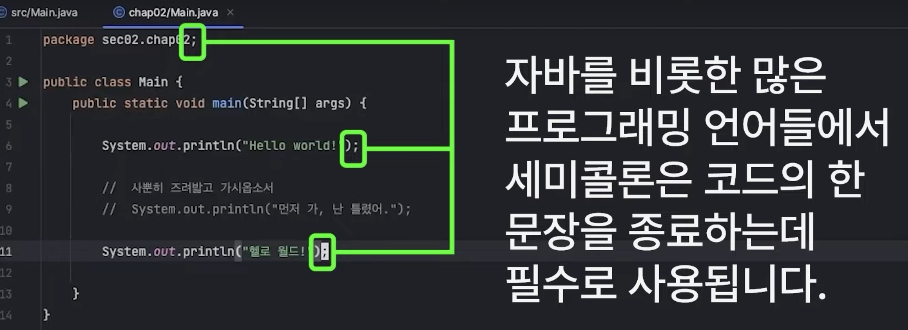

# 코드 종료시에는 세미콜론을 작성한다!

---
# [java 자료형1](./java%20자료형1.md)
- 변수 & 상수 
- 정수형
- 실수형 
- 불리언형 
- 문자형 
---
# [java 자료형2](./java%20자료형2.md)

---
# [java 기본함수](./java%20기본함수.md)

---
# [java 조건문](./java%20조건문.md)

---
# [java 반복문](./java%20반복문.md)

---
# [java 배열](./java%20배열.md)

---
# 참고문서 
- https://yalco.notion.site/3-a7bb23eef6eb4e699f79c7909e56393c

