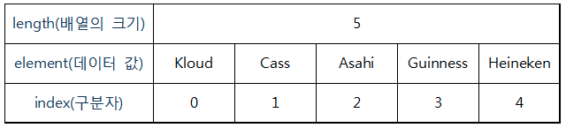

# [java 배열(Array)](https://m.blog.naver.com/heartflow89/220950491600)
동일한 자료형(Data Type)의 데이터를 연속된 공간에 저장하기 위한 자료구조이다. 
즉, 연관된 데이터를 그룹화하여 묶어준다고 생각하면 된다. 

---
- 자료형[] 변수 = {데이터1, 데이터2, 데이터3, ... };

```java
String[] beer = {"Kloud", "Cass", "Asahi", "Guinness", "Heineken"};

System.out.println(beer[0]); // Kloud
System.out.println(beer[1]); // Cass

for (int i=0; i < beer.length; i++) {
  System.out.println(beer[i]);
}
```
---
- 자료형[] 변수 = new 자료형[배열 크기];
```java
int[] score = new int[3]; // 크기가 3인 배열 생성
score[0] = 10; // 0번 index에 값 할당
score[1] = 15; // 1번 index에 값 할당
score[2] = 13; // 2번 index에 값 할당

int sum = 0;
for (int i = 0; i < score.length; i++) { // score.length = 5
  sum += score[i]; // sum = sum + score[i];
}

double avg = (double) sum / score.length; // 형변환
System.out.println("점수 합계 : " + sum);
System.out.println("점수 평균 : " + avg);
```
---
# [java 리스트(list)](https://velog.io/@sunnamgung8/%EC%9E%90%EB%B0%94List%EC%BB%AC%EB%A0%89%EC%85%98)
리스트(List)란 저장된 요소들의 순서가 있고 데이터에 중복이 가능하고 인덱스(index) 번호에 의해서 정렬됩니다. (배열과 비슷한 동작을 합니다.)


