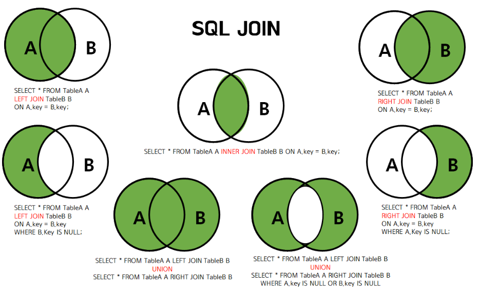
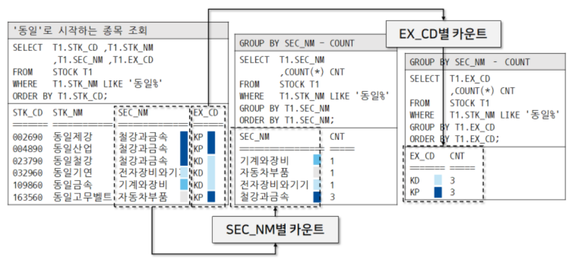

# [DML(Data Manipulation Language)](https://www.fun-coding.org/mysql_basic4.html#gsc.tab=0)
테이블의 데이터를 삽입, 조회, 수정, 삭제하는 구문

---
## 데이터 생성
```sql
mysql> INSERT INTO 테이블명 (col1, col2, ...) VALUES(value1, value2, ...);
```

## 데이터 수정
```sql
mysql> UPDATE 테이블명 SET 컬럼1 = '수정할 값' WHERE 컬럼2 = '값';
```

## 데이터 삭제
```sql
mysql> DELETE FROM 테이블명 WHERE 컬럼1 = '값';
```

---
## 데이터 조회 
```sql
mysql> SELECT * FROM 테이블명;
mysql> SELECT 컬럼1, 컬럼2, ... FROM 테이블명;
mysql> SELECT 컬럼1 as 뉴 컬럼1, 컬럼2 as 뉴 컬럼2, ... FROM 테이블명;
```

- 데이터 정렬해서 조회
```sql
# DESC(내림차순), ASC(오름차순)
mysql> SELECT * FROM 테이블명 order by 컬럼1 DESC;
mysql> SELECT * FROM 테이블명 order by 컬럼1, 컬럼2 ASC;
```

---
- 조건으로 데이터 조회
```sql
mysql> SELECT * FROM 테이블명 WHERE 컬럼1 = '값'
mysql> SELECT * FROM 테이블명 WHERE 컬럼1 > '값'
mysql> SELECT * FROM 테이블명 WHERE 컬럼1 = '값' and 컬럼2 > '값'
mysql> SELECT * FROM 테이블명 WHERE 컬럼1 = '값' or 컬럼2 < '값'
mysql> SELECT * FROM 테이블명 WHERE 컬럼1 LIKE '%값%'
```
- 조회 결과 중 일부만 조회
```sql
mysql> SELECT * FROM 테이블명 LIMIT 10; # 결과중 처음부터 10개만
mysql> SELECT * FROM 테이블명 LIMIT 100, 10; # 결과중 100번째부터 10개만
```

---
## [Join 데이터 조회](https://inpa.tistory.com/entry/MYSQL-%F0%9F%93%9A-JOIN-%EC%A1%B0%EC%9D%B8-%EA%B7%B8%EB%A6%BC%EC%9C%BC%EB%A1%9C-%EC%95%8C%EA%B8%B0%EC%89%BD%EA%B2%8C-%EC%A0%95%EB%A6%AC) 


---
- Inner Join
```sql
select u.userid, name 
from usertbl as u inner join buytbl as b 
on u.userid=b.userid 
where u.userid="111" -- join을 완료하고 그다음 조건을 따진다.
```
```sql
select u.userid, name 
from usertbl u, buytbl b 
where u.userid=b.userid and u.userid="111"
```

---
- Left Join
```sql
-- 예) 1학년 학생의 이름과 지도교수명을 출력하라. 단, 지도교수가 지정되지 않은 학생도 출력되게 하라.

SELECT STUDENT.NAME, PROFESSOR.NAME 
FROM STUDENT LEFT OUTER JOIN PROFESSOR -- STUDENT를 기준으로 왼쪽 조인
ON STUDENT.PID = PROFESSOR.ID 
WHERE GRADE = 1
```
- Right Join
```sql
-- 예) 1학년 학생의 이름과 지도교수명을 출력하라. 단, 지도교수가 지정되지 않은 학생도 출력되게 하라.

SELECT STUDENT.NAME, PROFESSOR.NAME 
FROM STUDENT RIGHT OUTER JOIN PROFESSOR -- PROFESSOR를 기준으로 오른쪽 조인
ON STUDENT.PID = PROFESSOR.ID 
WHERE GRADE = 1
```
---
- Full Outer Join
```sql
select * 
from topic FULL OUTER JOIN autor 
on topic.auther_id = authoer.id
```
```sql
(select * from topic LEFT JOIN autor on topic.auther_id = authoer.id)) 
UNION 
(select * from topic RIGHT JOIN autor on topic.auther_id = authoer.id))
```

---
## [Group by 데이터 조회](https://wikidocs.net/132421)


---
- `SUM`: 그룹별로 합계를 구하는 집계함수
- `MIN/MAX`: 그룹별로 최소, 최댓값을 구하는 집계함수
- `COUNT`: 그룹별로 건수를 카운트하는 집계함수
- `AVG`: 그룹별로 평균을 구하는 집계함수
- `HAVING`: HAVING절은 WHERE절과 유사하게 조회할 데이터를 걸러내는 역할

```sql
# A컬럼별 카운트 집계
mysql> SELECT COUNT(*) CNT FROM 테이블명 GROUP BY A컬럼; 

# A컬럼별 카운트 집계 및 A컬럼으로 정렬 
mysql> SELECT A컬럼, COUNT(*) CNT FROM 테이블명 GROUP BY A컬럼 ORDER BY A컬럼; 

# A컬럼별 카운트 집계 및 Having 조건 및 A컬럼으로 정렬 
mysql> SELECT A컬럼, COUNT(*) CNT FROM 테이블명 GROUP BY A컬럼 HAVING A컬럼 = 'AA' ORDER BY A컬럼; 
```

---
- 컬럼의 데이터 변경 
    - SUBSTR()를 이용하여 변경가능하다. 
```sql
SELECT  SUBSTR(T1.STK_NM,1,2) STK_SUB_NM ,T1.STK_NM
FROM    STOCK T1
WHERE   (T1.STK_NM LIKE '삼성%' OR T1.STK_NM LIKE '현대%')
ORDER BY T1.STK_NM;
```
- DT(일자) 컬럼을 DATE_FORMAT을 사용해 연월로 변형한 후에 GROUP BY 처리한 SQL
```sql
SELECT  DATE_FORMAT(T1.DT,'%Y%m') YM ,COUNT(*) CNT
FROM    HISTORY_DT T1
WHERE   T1.STK_CD = '005930'
GROUP BY DATE_FORMAT(T1.DT,'%Y%m')
ORDER BY YM ASC;
```

---
- 여러 컬럼 GROUP BY
```sql
SELECT  T1.EX_CD ,T1.SEC_NM ,COUNT(*) CNT
FROM    STOCK T1
WHERE   T1.STK_NM LIKE '동일%'
GROUP BY T1.EX_CD ,T1.SEC_NM
ORDER BY T1.EX_CD ,T1.SEC_NM;
```
- HAVING 적용 
```sql
SELECT  T1.STK_CD ,SUM(T1.C_PRC * T1.VOL) SUM_VOL_AMT
FROM    HISTORY_DT T1
WHERE   T1.DT >= STR_TO_DATE('20190201','%Y%m%d')
AND     T1.DT < STR_TO_DATE('20190301','%Y%m%d')
GROUP BY T1.STK_CD
HAVING SUM(T1.VOL * T1.C_PRC) > 2000000000000
ORDER BY STK_CD ASC;
```


