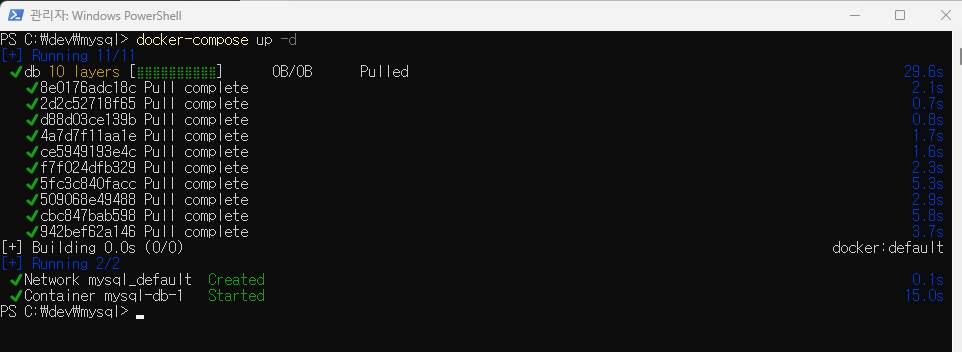

# MySQL 설치
## 사전준비 
- dbeaver 설치 
- Docker 설치
- mysql 설치 폴더 생성
    - mkdir ./mysql
    - mkdir ./mysql/database 

---
- ./mysql/docker-compose.yml 파일 생성 
```
version: "3"

services:
  db:
    image: mysql
    restart: always
    command:
      - --character-set-server=utf8mb4
      - --collation-server=utf8mb4_unicode_ci
    volumes:
      - ./database:/var/lib/mysql
    environment:
      MYSQL_ROOT_PASSWORD: "root1234"
      MYSQL_DATABASE: "examplesdb"
      MYSQL_USER: "urstory"
      MYSQL_PASSWORD: "u1234"
    ports:
      - "3306:3306"

```

---
# Docker를 이용한 MySQL 설치 
```
> cd ./mysql # docker-compose.yml이 있는 폴더로 이동 
```


---
```
> docker-compose up -d # mysql 생성 및 실행 
```


---
```
> docker ps # 생성된 mysql 확인 
```

```
> cd database
> ls # database 폴더에 mysql이 잘 설치되어 있는지 확인 
```


---
- Docker Desktop에서 mysql 확인 


