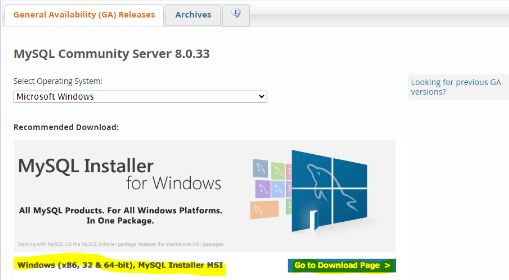
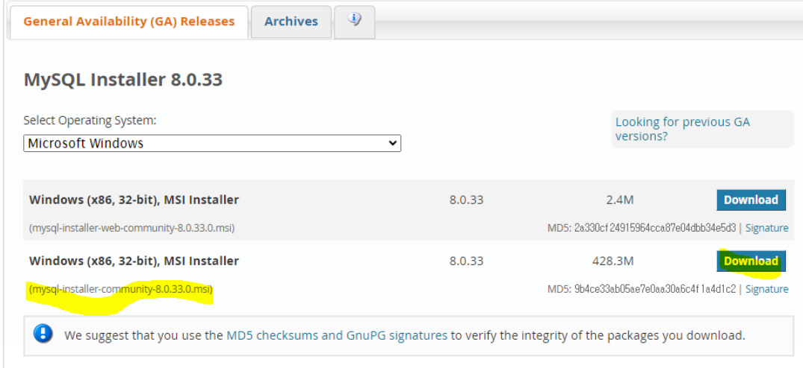
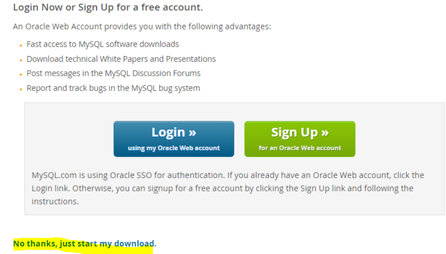
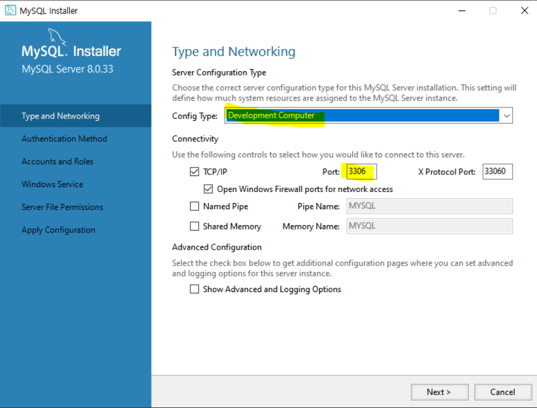
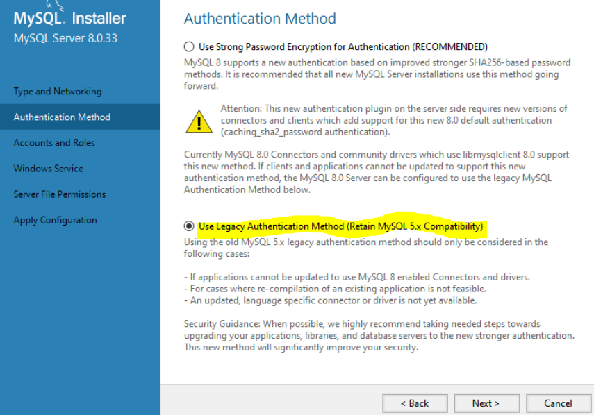
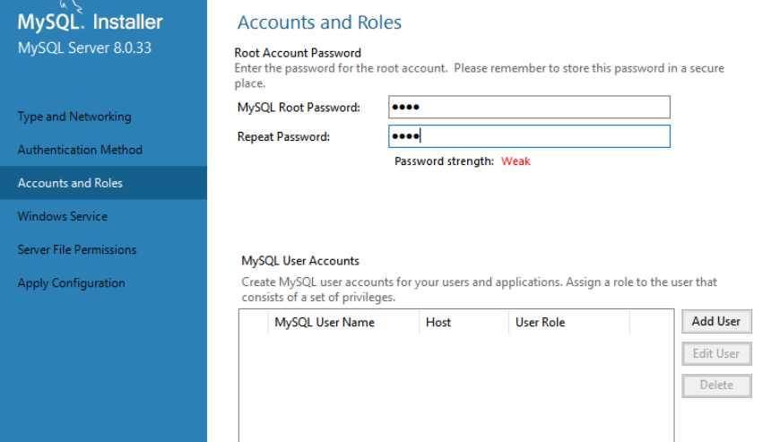
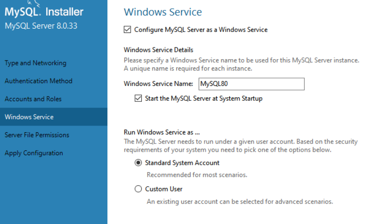
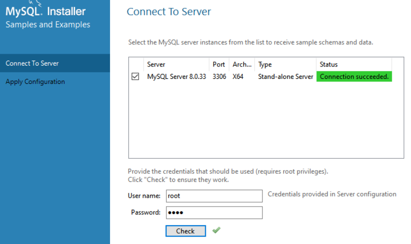
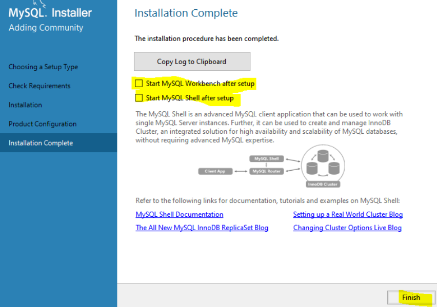
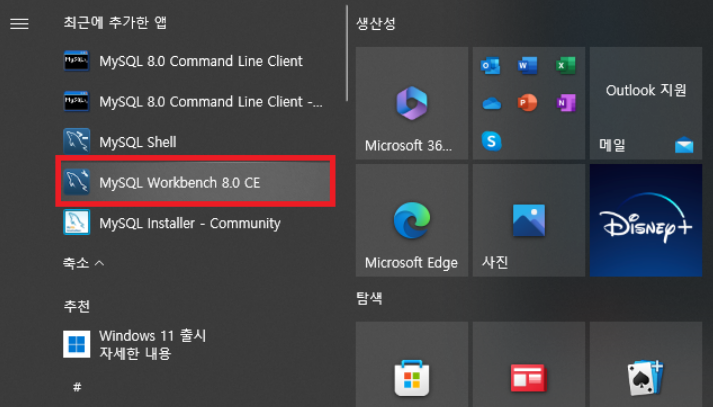

# [MySQL Community Downloads](https://dev.mysql.com/downloads/mysql/)

---

---

---

---

---
### 관리자 계정의 비번 생성
- 관리자 계정은 Root입니다.

---
### 윈도우즈(OS)에 서비스 등록

---
### Connect To Server
- 관리자 계정(root)로 접속 

---

---
# 설치 결과 확인

