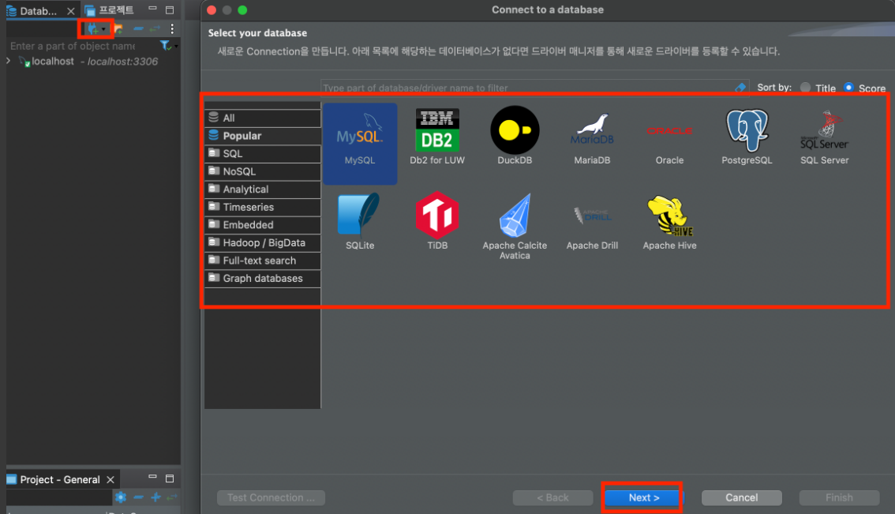
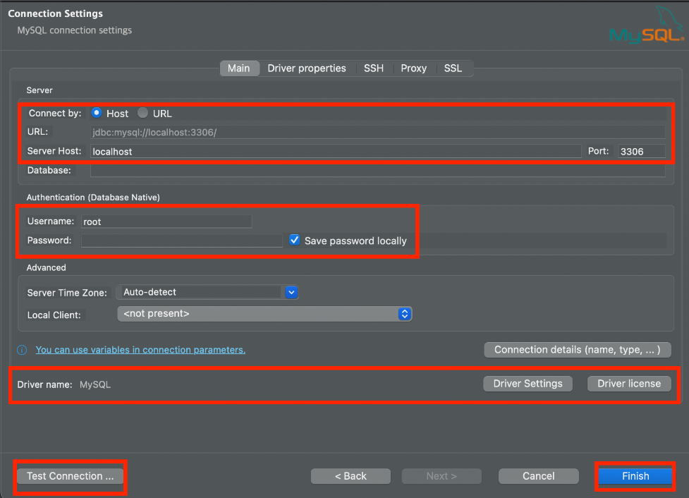
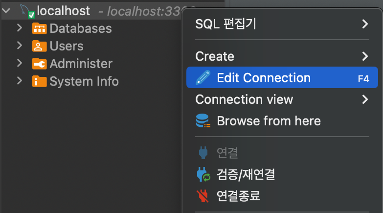
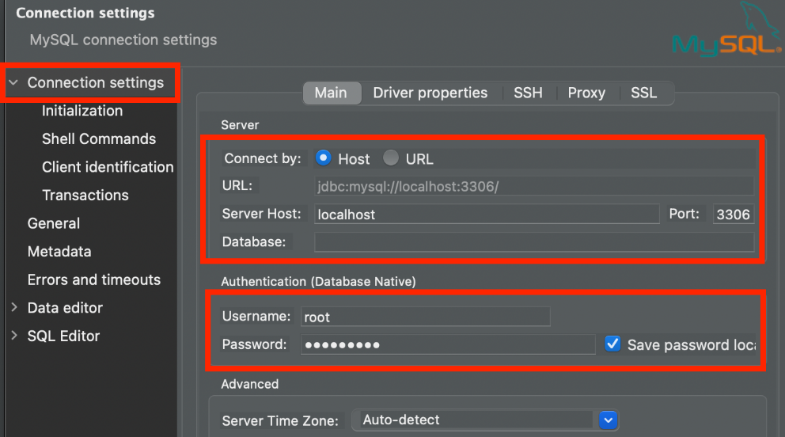
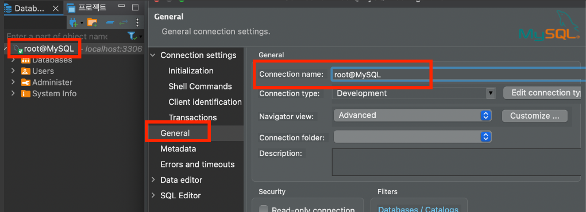
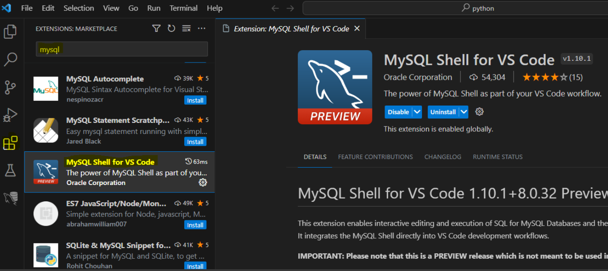
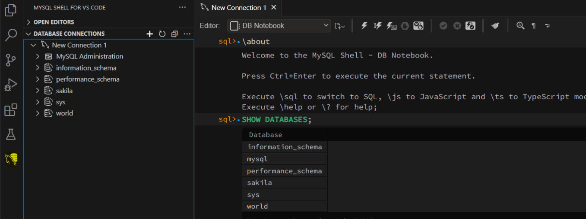

# [MySQL](https://www.mysql.com/)
- MySQL은 오픈소스 관계형 데이터베이스 관리 시스템입니다.
- 사용자는 SQL이라는 구조화된 쿼리 언어를 사용하여 데이터를 정의, 조작, 제어, 쿼리할 수 있습니다.
- MySQL은 오픈소스이므로 25년 이상 사용자와 긴밀히 협력하여 개발한 여러 기능이 포함되어 있습니다.

---
# 설치방법 
- [Installer를 이용한 설치방법](./MySQL%20Installer.md)
- [Docker를 이용한 설치방법](./MySQL%20Docker.md)

---
# [MySQL Server 구동방법](https://tableplus.com/blog/2018/10/how-to-start-stop-restart-mysql-server.html)

```bash
 > mysql.server start # 서버 시작
 > mysql.server stop # 서버 멈춤
 > mysql.server restart # 서버 재시작
 > mysql.server status # 서버 상태확인
 ```

---
# [DDL(Data Definition Language)](./MySQL%20DDL.md)
데이터베이스와 테이블을 정의, 수정, 삭제하는 구문

---
# [DCL(Data Control Language)](./MySQL%20DCL.md)
데이터의 보안, 무결성, 회복 등을 제어하는 구문

---
# [DML(Data Manipulation Language)](./MySQL%20DML.md)
테이블의 데이터를 삽입, 조회, 수정, 삭제하는 구문

---
# 개발 툴 
## [DBeaver](https://dbeaver.io/)
- Community Edition 버전을 사용하면 라이센스(Apache License)가 무료이다.
- 자바/이클립스 기반으로 개발되어서 윈도우, 리눅스, MAC에서 구동된다.
- JDBC 기반으로 DB를 연결해서 그런지 엄청나게 많은 DB를 지원한다. (ORACLE, MySQL, Mariadb, Postgresql, Greenplum ... )
- 개발소스가 공개되어서 버그픽스가 가능하고 새로운 기능을 개발하여 사용이 가능하다.

---


---


---


---


---


---
## [VS Code](https://marketplace.visualstudio.com/items?itemName=Oracle.mysql-shell-for-vs-code)


---


