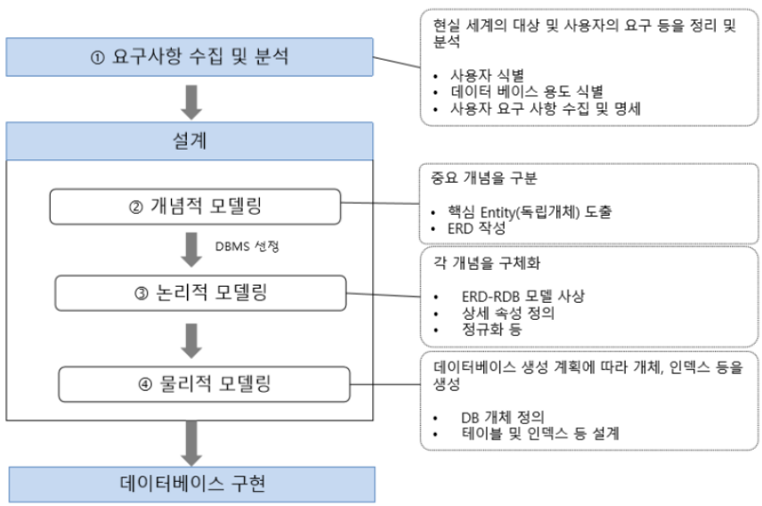

# [데이터 모델링 & ERD](https://inpa.tistory.com/entry/DB-%F0%9F%93%9A-%EB%8D%B0%EC%9D%B4%ED%84%B0-%EB%AA%A8%EB%8D%B8%EB%A7%81-1N-%EA%B4%80%EA%B3%84-%F0%9F%93%88-ERD-%EB%8B%A4%EC%9D%B4%EC%96%B4%EA%B7%B8%EB%9E%A8)

---
## 데이터 모델링
- 데이터 모델링이란 정보시스템 구축의 대상이 되는 업무 내용을 분석하여 이해하고 약속된 표기법에 의해 표현하는걸 의미한다. 그리고 이렇게 분석된 모델을 가지고 실제 데이터베이스를 생성하여 개발 및 데이터 관리에 사용된다.
- 특히 데이터를 추상화한 데이터 모델은 데이터베이스의 골격을 이해하고 그 이해를 바탕으로 SQL문장을 기능과 성능적인 측면에서 효율적으로 작성할 수 있기 때문에, 데이터 모델링은 데이터베이스 설계의 핵심 과정이기도 하다.

---

---
## 데이터 모델링 순서 
1. `업무파악(요구사항 수집 및 분석)`
    - 업무 파악은 어떠한 업무를 시작하기 전에 해당하는 업무에 대해서 파악하는 단계 이다.
    - 모델링에 앞서 가장 먼저 해야 할 것은 어떠한 업무를 데이터화하여 모델링 할 것인지에 대한 요구사항 수집일 것이다.
    - 업무파악을 하기 좋은 방법으로는 UI를 의뢰인과 함께 확인해 나아가는 는 것이다.
    - 그리고 궁극적으로 만들어야 하는 것이 무엇인지 심도있게 알아보아야 한다.

---
2. `개념적 데이터 모델링(ERD 작성)`
    - 개념적 모델링은 Entity 를 도출하고 ERD를 작성하는 단계이다.

---
3. `논리적 데이터 모델링`
    - 논리적 모델링은 ERD 를 사용할 특정 DBMS 의 논리적 자료구조에 맞게 사상 (Mapping) 하는 과정이다.
    - 예를들어 RDBMS 를 사용한다고 하면, ERD를 RDB로 사상한다. 테이블 설계와 정규화도 여기서 이루어진다.

---
4. `물리적 데이터 모델링`
    - 물리적 데이터 모델링은 최종적으로 데이터를 관리할 데이터 베이스를 선택하고, 선택한 데이터 베이스에 실제 테이블을 만드는 작업 을 말한다.
    - [MySQL 제약 조건](https://dev-coco.tistory.com/55)

---
## 데이터 모델링 절차 정리

---
# [ERD](https://hudi.blog/entity-relation-diagram/)
ERD란 Entity-Relation Diagram (개체-관계 다이어그램) 의 준말이다. 데이터베이스 설계 단계에서 맨 처음 단계인 개념적 모델링 단계에서 ERD 를 작성하게 된다.

#### Entity (개체)란
현실에 존재하는 개별적으로 식별할 수 있는 물리적 또는 추상적인 개체를 의미한다.
- 각 Entity 는 특징을 나타낼 수 있는 Attribute (속성) 들을 가지고 있다.
- 예를 들어 ‘학생’ 이라는 Entity 는 ‘학번’, ‘학생 이름’ 등의 Attribute 를 가질 수 있고, ‘수업’ 이라는 Entity 는 ‘학수번호’, ‘수업 이름’ 등의 Attribute 를 가질 수 있다.

#### ER(개체-관계) 모델은
위에서 설명한 Entity 사이의 Relation (관계) 을 통해 현실 세계를 표현하기 위한 설계 방식이다.
- 예를 들어 ‘학생’ 과 ‘수업’ Entity 끼리는 ‘수강하다’ 라는 관계를 맺을 수 있다.

---
## ERD 표기법 
ERD 표기법에는 Peter-Chen 표기법, IE 표기법 등이 있으며, 그 중에서 IE 표기법이 가장 많이 사용되고 있습니다.

---
- Entity
  - 엔티티는 정의 가능한 사물 또는 개념을 의미한다.
  - 데이터베이스의 테이블이 엔티티로 표현된다고 보면 된다.

---
- Attribute:    
  - 엔티티에는 개체가 갖고있는 속성(Attribute)을 포함한다.
  - 데이터베이스의 테이블의 각 필드(컬럼)들이 엔티티 속성이라고 보면 된다.

---
- 주 식별자(PK)
  - 데이터베이스 테이블의 Primary Key를 표현
  - 중복이 없고 NULL 값이 없는 유일한 값에 지정하는 식별자

---
- 외래 식별자(FK)
  - 데이터베이스 테이블의 Foreign Key를 표현
  - 외래 식별자를 표시할 때에는 선을 이어주는데 개체와 관계를 따져 표시한다.

---
- Domain:  
  - 도메인은 속성의 값, 타입, 제약사항 등에 대한 갑의 범위를 표현하는 것이다.
  - 이때 데이터 타입을 명시할때, 데이터베이스가 지원하는 타입에 맞게 해야한다.

---
- 제약 조건 (NOT NULL)
  - 해당 속성에 들어갈 값에 Null 을 비허용한다면, N 혹은 NN을 적는다.
  - 만일 Null 허용한다면 N을 적지 않는다.

---
- Relation
부모 자식 관계에서 자식이 부모의 주 식별자를 외래 식별자로 참조해서 자신의 주 식별자로 설정

---
- Relation
부모 자식 관계에서 자식이 부모의 주 식별자를 외래 식별자로 참조해서 일반 속성으로 사용.

---
- Mapping Cardinality:     
개체와 개체간의 Mapping Cardinality (대응수) 란, 특정 Entity 가 상대 Entity 와 관계를 몇 회 맺을 수 있는지를 나타낸다.
  - 학생과 학급의 소속 관계를 살펴보자. 한 학급에는 여러 학생이 소속될 수 있지만, 한 학생이 여러 학급에 소속될 수는 없다. 이때, 학생과 학급의 Cardinality 는 N:1 이다.
  - 이번에는 학생과 학생의 짝꿍 관계를 살펴보자. 한 학생이 다른 학생과 짝꿍관계를 맺을 수 있는 관계의 경우의 수는 서로 1회밖에 없다. 따라서 이 관계의 Cardinality 는 1:1 이다.
  - 마지막으로 학생과 동아리간의 소속 관계를 살펴보자. 하나의 학생은 여러 동아리에 소속될 수 있다. 하나의 동아리 또한 여러 학생을 소속시킬 수 있다. 따라서 이 관계의 Cardinality 는 N:N 이다.

---

---

---

---

---
## ERD 다이어그램 툴 
- [ERD CLOUD](https://inpa.tistory.com/entry/ERD-CLOUD-%E2%98%81%EF%B8%8F-ERD-%EB%8B%A4%EC%9D%B4%EC%96%B4%EA%B7%B8%EB%9E%A8%EC%9D%84-%EC%98%A8%EB%9D%BC%EC%9D%B8%EC%97%90%EC%84%9C-%EA%B7%B8%EB%A0%A4%EB%B3%B4%EC%9E%90)

---
- [MySQL 워크벤치 ERD 생성](https://inpa.tistory.com/entry/MYSQL-%F0%9F%93%9A-%EC%9B%8C%ED%81%AC%EB%B2%A4%EC%B9%98%EC%97%90%EC%84%9C-%ED%85%8C%EC%9D%B4%EB%B8%94-ERD-%EC%83%9D%EC%84%B1%ED%95%98%EA%B8%B0)

---
- DBeaver ERD 생성

