# 웹 프로젝트 생성 
- Ctrl + shift + p 
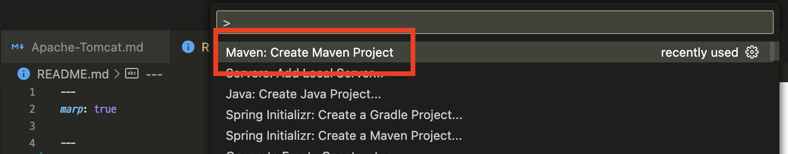

---
- maven-archetype-webapp 선택 
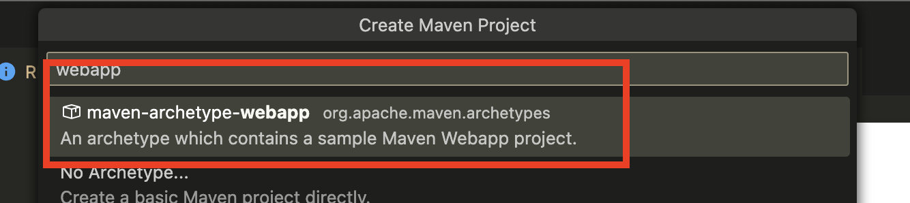

- 버전 선택 
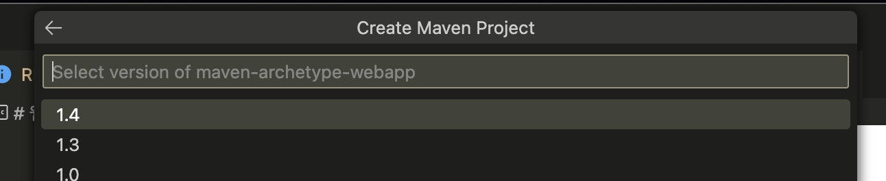

---
- 기본값 사용 

- 프로젝트명 작성 
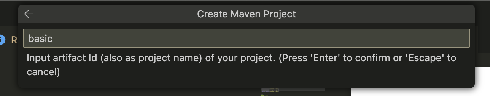

---
- 프로젝트 생성될 폴더 선택 
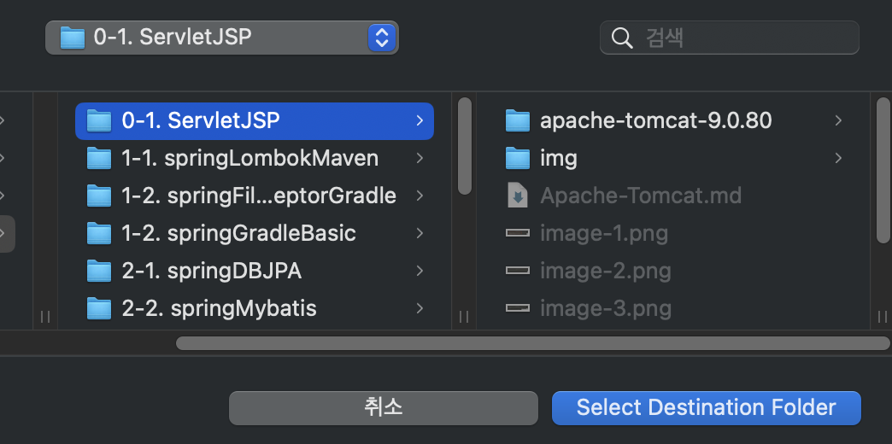

---
- 새로 생성된 프로젝트 폴더로 vscode 재실행 
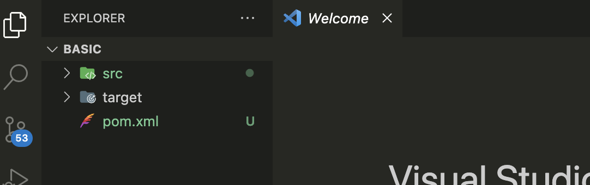

---
# Maven으로 프로젝트 Build
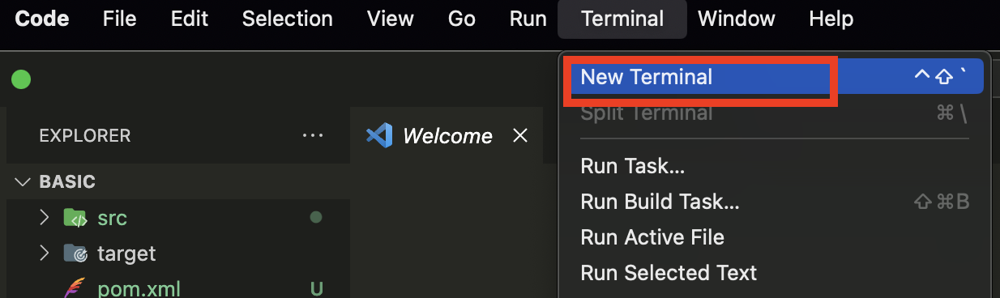

---
- 프로젝트 폴더로 이동 
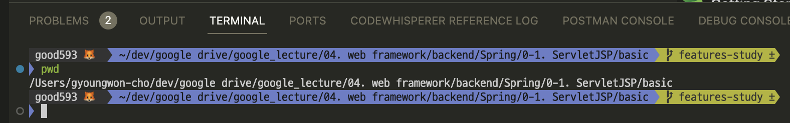

---
- Maven으로 프로젝트 빌드 -> basic.war 생성 
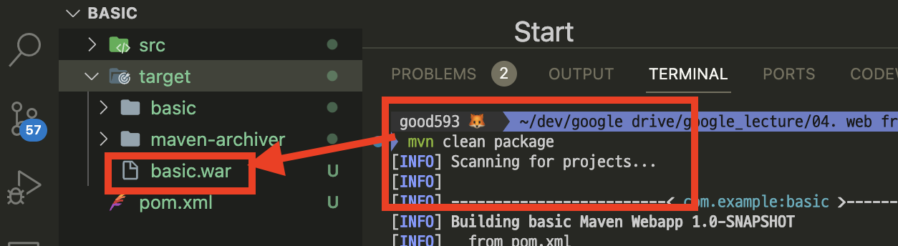

---
# Tomcat 서버에 반영 
- basic.war 파일을 서버에 반영 
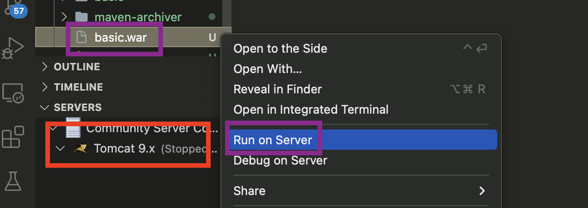

---
- 톰캣 서버 선택 
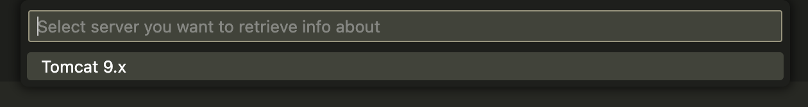
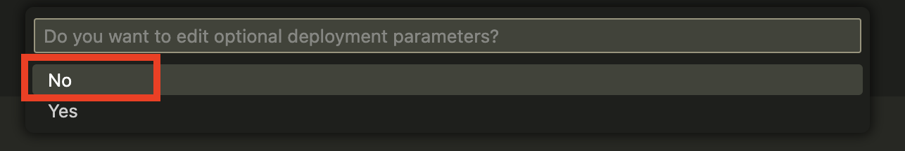

---
- 톰캣 서버에 war 파일 반영 확인 
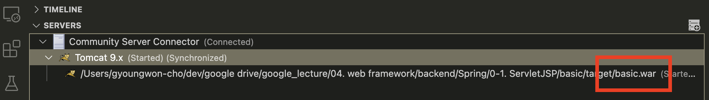

---
# 톰캣 서버 실행 후 반영 확인 
- manager 페이지에서 basic 프로젝트 url 확인 
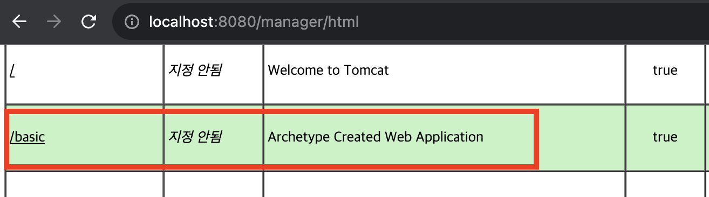

---
- basic 프로젝트 index.jsp 화면 접속 !!
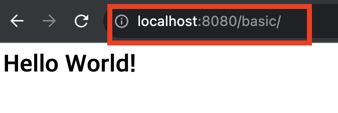

---
- index.jsp 파일 위치 및 내용 확인!!
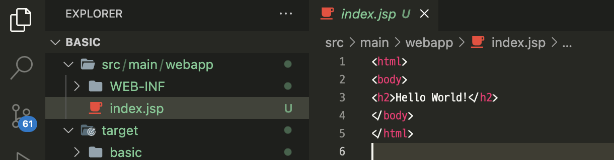

