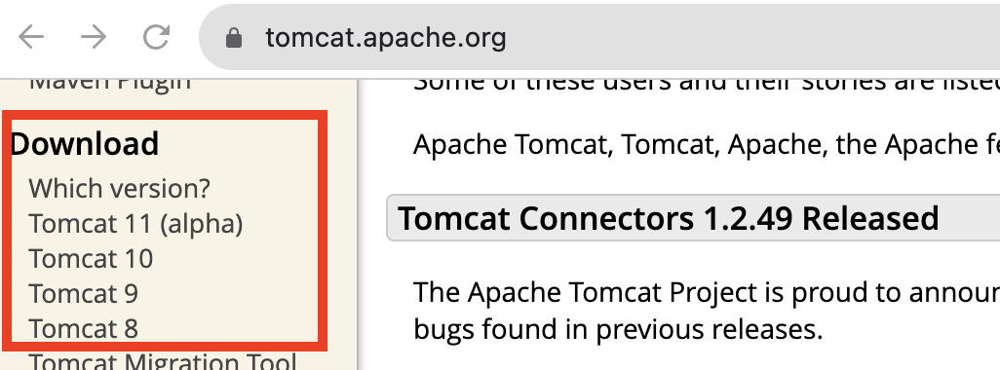
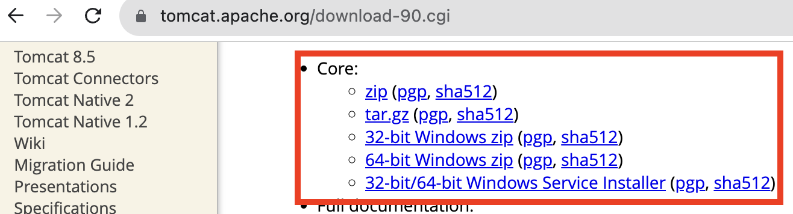
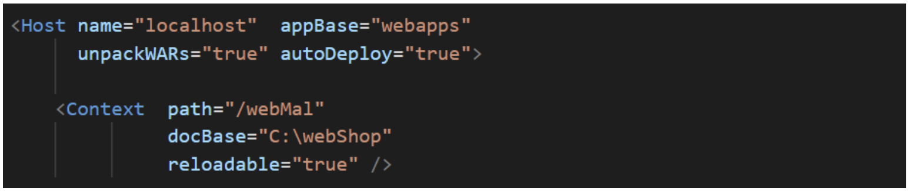
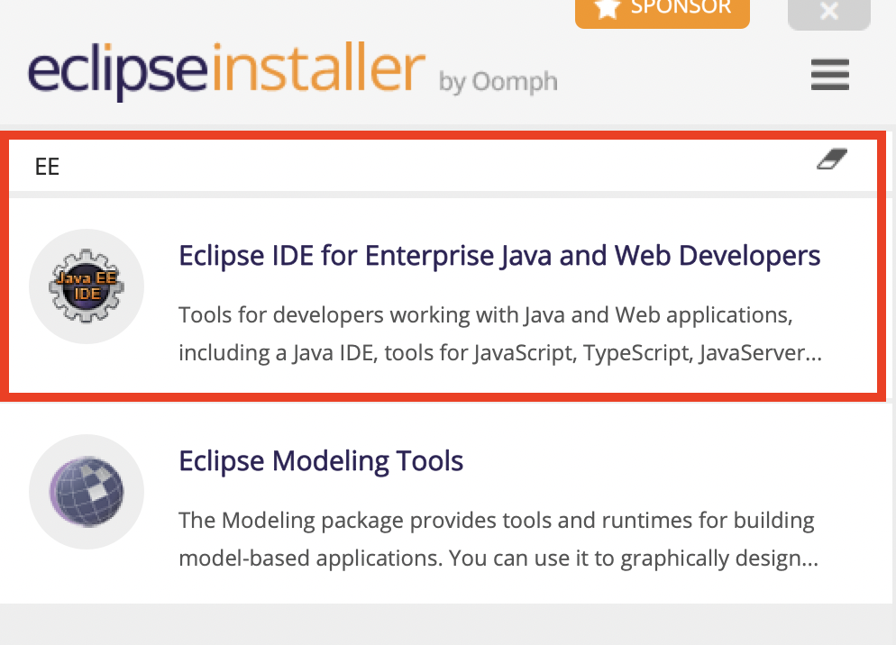
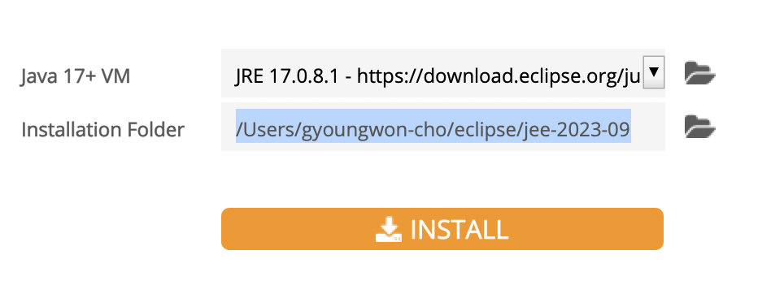
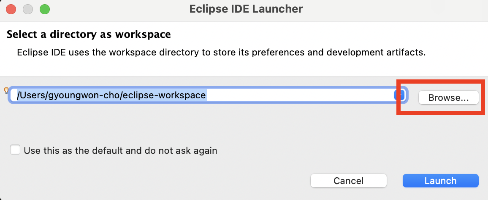
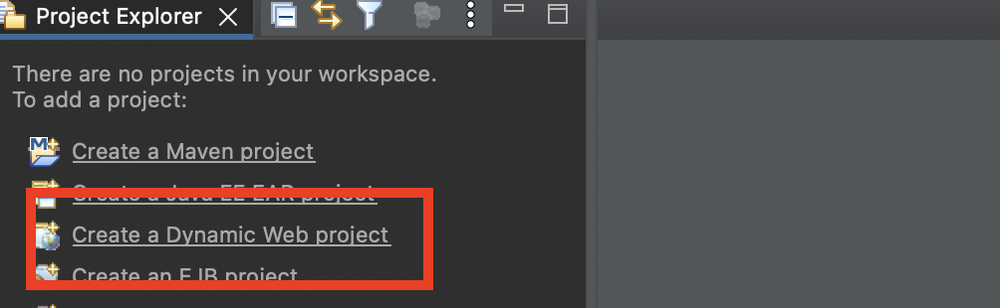
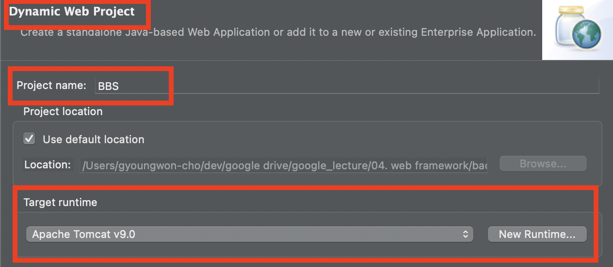

# [Apache Tomcat](https://inpa.tistory.com/entry/TOMCAT-%E2%9A%99%EF%B8%8F-%EC%84%A4%EC%B9%98-%EC%84%A4%EC%A0%95-%EC%A0%95%EB%A6%AC)

---
## 아파치(Apache)
- 아파치 소프트웨어 재단에서 만든 웹서버(web server)를 일컫는다.
- 정적인 데이터들 (html, css 이미지, 파일 등)에 대한 클라이언트의 요청을 데이터로 만들어서 응답한다.
- 80 포트 사용 

## 톰캣(Tomcat)
- 현재 가장 일반적이고 많이 사용되는 WAS(웹 애플리케이션 서버)
- 톰캣(WAS)는 JSP와 서블릿 처리, 서블릿의 수명 주기 관리, 요청 URL을 서블릿 코드로 매핑, HTTP 요청 수신 및 응답, 필터 체인 관리 등을 처리해준다.
- 8080 포트 사용 

---
## 아파치 톰캣(Apache + Tomcat)
- 웹서버(아파치)는 정적인 데이터를 처리하는 서버. 이미지나 단순 HTML을 처리하는 서버라면 웹 서버가 적당하며 빠르고 안정적이다.
- WAS(톰캣)은 동적인 데이터를 처리하는 서버. DB연결, 데이터 조작등과 같은 처리는 WAS를 활용해야 한다.

하지만 톰캣(WAS)에서 편의를 위해 아파치의 기능(웹서비스 데몬, Httpd)을 포함하고 있다. 
  - 즉, 톰캣이 아파치의 기능 일부를 가져와서 제공해주는 형태이기 때문에 톰캣을 아파치 톰캣으로도 부른다.

---
# [Apache Tomcat 설치](https://tomcat.apache.org/index.html) 



---


---
### Context 태크 추가 
  - Host 태그 아래에 작성 
```xml

<Host name="localhost"  appBase="webapps"
            unpackWARs="true" autoDeploy="true">

  <Context path="/컨텍스트 이름 (경로)"
           docBase="실제 웹 애플리케이션의 디렉토리 위치"
           reloadable="true 또는 false (자바 class 변경시 자동반영 유무)" />

```

---
- 예제 


---


---


---


---


---


---


---
# 참고 문서 
- https://www.youtube.com/watch?v=wEIBDHfoMBg&list=PLRx0vPvlEmdAZv_okJzox5wj2gG_fNh_6&index=1&t=73s
