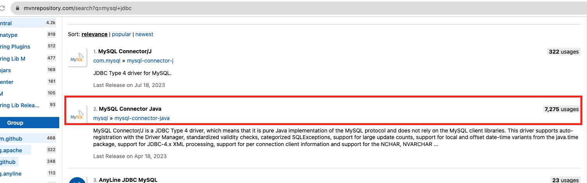
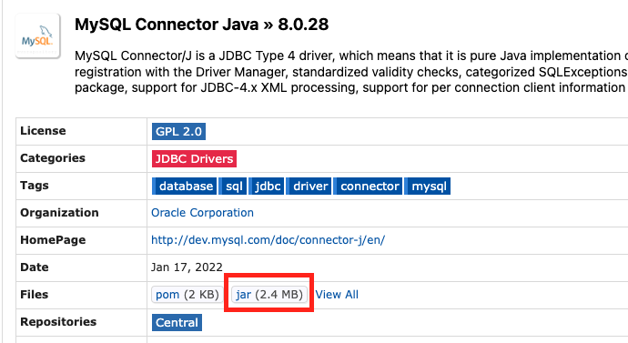
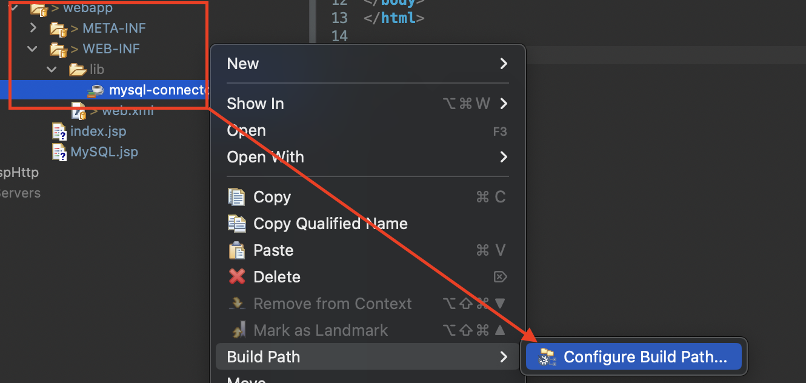
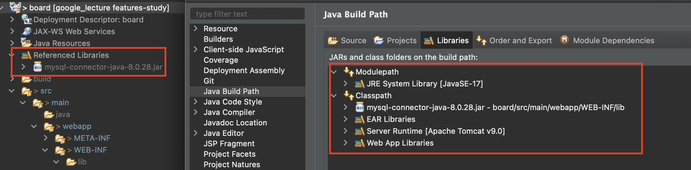
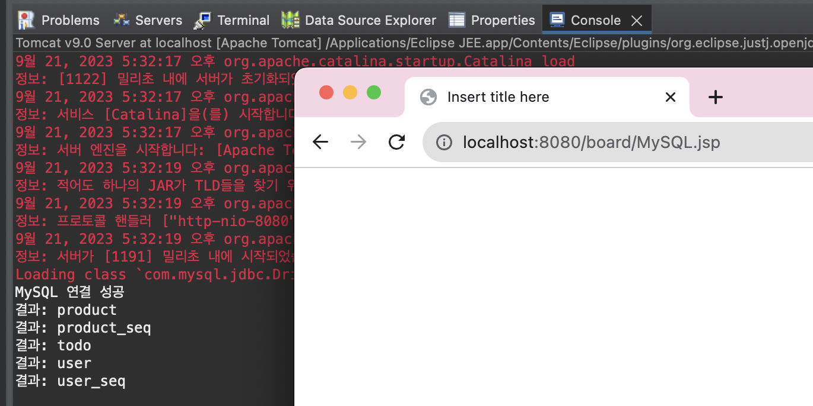

# [MySQL Connector 다운로드](https://mvnrepository.com/search?q=mysql+jdbc)

---


---


---


---
# 프로젝트에 MySQL 라이브러리 추가 


---


---
# 프로젝트에서 MySQL 접속 테스트 

---
- MySQL 접속할 jsp 파일 

```jsp
<%@ page language="java" contentType="text/html; charset=UTF-8"
    pageEncoding="UTF-8"%>

<%@ page import="java.sql.*"%>

<% request.setCharacterEncoding("utf-8");%>
    
<!DOCTYPE html>
<html>
<head>
<meta charset="UTF-8">
<title>Insert title here</title>
</head>
<body>
<%
	String url = "jdbc:mysql://localhost:3306/examplesdb";
	String user = "urstory";
	String password = "u1234";
	
	Connection conn=null;
	PreparedStatement pstmt=null;
	ResultSet rs = null;
	
	try {
		Class.forName("com.mysql.jdbc.Driver");
		conn = DriverManager.getConnection(url, user, password);
		
		System.out.println("MySQL 연결 성공 ");
		
		String sql = "show tables;";
		pstmt = conn.prepareStatement(sql);
		rs = pstmt.executeQuery();
		
		while(rs.next()) {
			
			System.out.println("결과: "+rs.getString("Tables_in_examplesdb"));
		}
		
	} catch (Exception e) {
		System.out.println("MySQL 연결 오류: "+e.getMessage());
	} finally {
		if(pstmt != null) 
 			try{pstmt.close();}catch(SQLException sqle){}
 		if(conn != null) 
 			try{conn.close();}catch(SQLException sqle){}
	}
%>
</body>
</html>

```
- table 생성 

```sql
CREATE TABLE board_table (
 num        INT NOT NULL AUTO_INCREMENT,
 title     VARCHAR(20) NOT NULL,
 writer    VARCHAR(20) NOT NULL,
 content   VARCHAR(100),
 reg_date    timestamp default now(),
 cnt int default 0,
 PRIMARY KEY(num)
);
```

---
- 접속 결과(테이블 조회)

