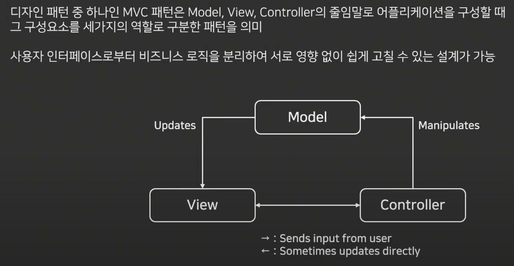

# 디자인 패턴 
> (소프트웨어) 디자인 패턴이란 특정 문맥에서 공통적으로 발생하는 문제에 대해 쓰이는 재사용 가능한 해결책 목적별로 일정한 패턴이 제시되어 있음    
### 장점
- 소프트웨어의 구조를 파악하기 용이함
- 재사용을 통해 개발 시간 단축 
### 단점 
- 객체지향적 설계를 고려하여 진행해야 함
- 초기 투자 비용이 많이 들어감(돈, 시간 등)

---
## MVC(Model View Controller) 패턴 

---
### Controller(컨트롤러)
- Model(모델)과 View(뷰)) 사이에서 브릿지 역할을 수행
- 앱의 사용자로부터 입력에 대한 응답으로 모델 및 뷰를 업데이트하는 로직을 포함
- 사용자의 요청은 모두 컨트롤러를 통해 진행되어야 함
### Model(모델)
- 데이터를 처리하는 영역
- 데이터베이스와 연동을 위한 DAO(Data Access Object)와 데이터의 구조를 표현하는 DO(Data Object)로 구성됨
### View(뷰)
- 데이터를 보여주는 화면 자체의 영역을 뜻함
- 사용자 인터페이스(UI) 요소들이 여기에 포함되며, 데이터를 각 요소에 배치함 

---
### MVC 패턴의 특징 
- 어플리케이션의 역할을 세 구간으로 나누어 설계함으로써 서로 간의 의존성이 낮아짐
- 각 영역이 독립적으로 구성되어 개발자 간 분업 및 협업이 원활해짐
- 한 영역을 업데이트 하더라도 다른 곳에 영향을 주지 않음 
