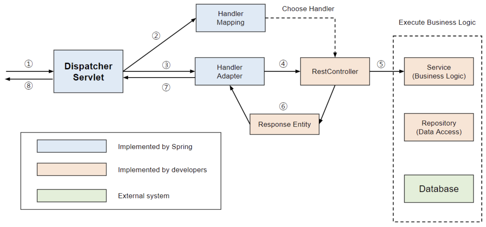
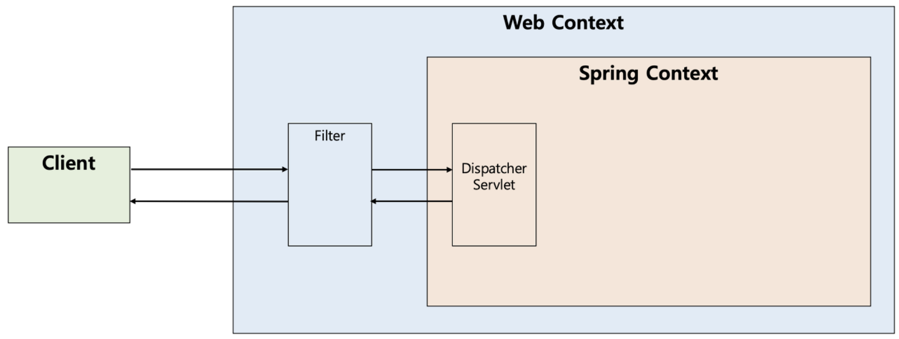
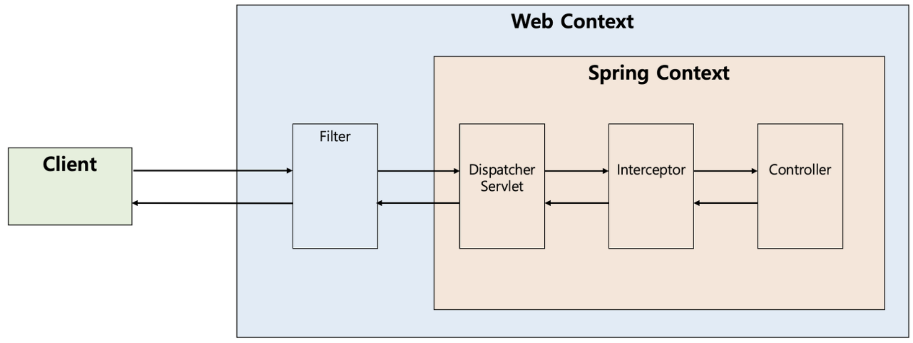

# [Gradle](https://velog.io/@appti/Spring-boot%EC%97%90%EC%84%9C%EC%9D%98-Gradle)
- Gradle은 유연한 오픈 소스 빌드 자동화 도구이다.

---
## Gradel Overview 
- 고성능(High performance)
  - Gradle은 변경 사항으로 인해 다시 실행해야 할 작업들만 실행하여 불필요한 작업을 방지합니다.
  - 빌드 캐시를 사용하여 이전 실행 또는 다른 시스템(공유 빌드 캐시 사용)의 작업 출력을 재사용할 수 있습니다.
- JVM(JVM foundation)
  - Gradle은 JVM에서 실행되므로 JDK(Java Development Kit)가 설치되어 있어야 합니다.
  - 다양한 플랫폼에서 Gradle을 실행할 수 있습니다.

---
- 관례(Conventions)
  - Maven의 규칙 일부를 가져오고 이를 구현하여 Java 프로젝트와 같은 일반적인 유형의 프로젝트를 쉽게 구축할 수 있습니다.
  - Gradle에서 기본으로 제공하는 플러그인을 사용하면 간단하게 빌드 스크립트를 작성할 수 있고, 필요하다면 사용자 정의 플러그인을 생성하는 것 또한 가능합니다.
- 확장성(Extensibility)
  - Gradle을 확장하여 고유한 작업 유형을 제공하거나 모델을 빌드할 수 있습니다.
  - Android 빌드 지원 참조

---
- IDE 지원
  - Android Studio, IntelliJ IDEA, Eclipse 및 NetBeans와 같은 여러 주요 IDE를 사용하여 Gradle 빌드를 가져와 상호 작용할 수 있습니다.
- 통찰력(Insight)
  - Build scan을 통해 빌드 문제를 식별하는 데 사용할 수 있는 빌드 실행에 대한 광범위한 정보를 제공합니다.
  - 빌드 성능과 관련된 문제를 식별하는 데 유용하며, 다른 사람과 공유도 가능합니다.

---
## Gradle 파일 구조 
```
├─ gradle
│       └─ wrapper
│       ├─ gradle-wrapper.jar
│       └─ gradle-wrapper.properties
├─ gradlew
├─ gradlew.bat
├─ build.gradle
└─ settings.gradle
```
- gradlew
  - 리눅스 또는 맥OS용 실행 쉘 스크립트 파일이다.
- gradlew.bat
  - 윈도우용 실행 배치 스크립트 파일이다.

---

- gradle-wrapper.jar
  - JAR 형식으로 압축된 Wrapper 파일이다. gradlew나 gradlew.bat 파일이 프로젝트 안에 설치되는 이 파일을 사용하여 Gradle task를 실행한다.
- gradle-wrapper.properties
  - Gradle Wrapper 설정 정보 파일이다. Wrapper의 버전 등을 설정할 수 있다.
- build.gradle
  - 프로젝트의 라이브러리 의존성, 플러그인, 라이브러리 저장소 등을 설정할 수 있는 빌드 스크립트 파일이다.
- settings.gradle
  - 프로젝트의 구성 정보 파일이다. 멀티 프로젝트를 구성하여 프로젝트를 모듈화할 경우, 하위 프로젝트의 구성을 설정할 수 있다.

---
# [Dispatcher-Servlet](https://mangkyu.tistory.com/18)
- 디스패처 서블릿의 dispatch는 "보내다"라는 뜻을 가지고 있습니다. 
- 그리고 이러한 단어를 포함하는 디스패처 서블릿은 HTTP 프로토콜로 들어오는 모든 요청을 가장 먼저 받아 적합한 컨트롤러에 위임해주는 프론트 컨트롤러(Front Controller)라고 정의할 수 있습니다.

---
## Dispatcher-Servlet 장점 
- Spring MVC는 DispatcherServlet이 등장함에 따라 web.xml의 역할을 상당히 축소시켜주었습니다. 
- 과거에는 모든 서블릿을 URL 매핑을 위해 web.xml에 모두 등록해주어야 했지만, 
  - dispatcher-servlet이 해당 어플리케이션으로 들어오는 모든 요청을 핸들링해주고 공통 작업을 처리면서 상당히 편리하게 이용할 수 있게 되었습니다. 
- 우리는 컨트롤러를 구현해두기만 하면 디스패처 서블릿가 알아서 적합한 컨트롤러로 위임을 해주는 구조가 되었습니다.

---
## Dispatcher-Servlet 동작 방식 


---
1. 클라이언트의 요청을 디스패처 서블릿이 받음
2. 요청 정보를 통해 요청을 위임할 컨트롤러를 찾음
3. 요청을 컨트롤러로 위임할 핸들러 어댑터를 찾아서 전달함
4. 핸들러 어댑터가 컨트롤러로 요청을 위임함
5. 비지니스 로직을 처리함
6. 컨트롤러가 반환값을 반환함
7. 핸들러 어댑터가 반환값을 처리함
8. 서버의 응답을 클라이언트로 반환함

---
# [Filter](https://mangkyu.tistory.com/173)
- 필터(Filter)는 J2EE 표준 스펙 기능으로 디스패처 서블릿(Dispatcher Servlet)에 요청이 전달되기 전/후에 url 패턴에 맞는 모든 요청에 대해 부가작업을 처리할 수 있는 기능을 제공한다. 
- 디스패처 서블릿은 스프링의 가장 앞단에 존재하는 프론트 컨트롤러이므로, 필터는 스프링 범위 밖에서 처리가 되는 것이다.

---
## Filter 동작 방식 


---
## Filter 메소드 
```java
public interface Filter {

    public default void init(FilterConfig filterConfig) throws ServletException {}

    public void doFilter(ServletRequest request, ServletResponse response,
            FilterChain chain) throws IOException, ServletException;

    public default void destroy() {}
}
```

---
- init()
  - init 메소드는 필터 객체를 초기화하고 서비스에 추가하기 위한 메소드이다.
- doFilter()
  - doFilter 메소드는 url-pattern에 맞는 모든 HTTP 요청이 디스패처 서블릿으로 전달되기 전에 웹 컨테이너에 의해 실행되는 메소드이다.
- destroy()
  - destroy 메소드는 필터 객체를 서비스에서 제거하고 사용하는 자원을 반환하기 위한 메소드이다. 

---
# [Interceptor](https://mangkyu.tistory.com/173)
- 인터셉터(Interceptor)는 J2EE 표준 스펙인 필터(Filter)와 달리 Spring이 제공하는 기술로써, 디스패처 서블릿(Dispatcher Servlet)이 컨트롤러를 호출하기 전과 후에 요청과 응답을 참조하거나 가공할 수 있는 기능을 제공한다. 
- 즉, 웹 컨테이너(서블릿 컨테이너)에서 동작하는 필터와 달리 인터셉터는 스프링 컨텍스트에서 동작을 하는 것이다.

---
## Interceptor 동작 방식 


---
## Interceptor 메소드 
```java
public interface HandlerInterceptor {

    default boolean preHandle(HttpServletRequest request, HttpServletResponse response, Object handler)
        throws Exception {
        return true;
    }

    default void postHandle(HttpServletRequest request, HttpServletResponse response, Object handler,
        @Nullable ModelAndView modelAndView) throws Exception {
    }

    default void afterCompletion(HttpServletRequest request, HttpServletResponse response, Object handler,
        @Nullable Exception ex) throws Exception {
    }
}
```

---
- preHandle()
  - preHandle 메소드는 컨트롤러가 호출되기 전에 실행된다. 
  - 그렇기 때문에 컨트롤러 이전에 처리해야 하는 전처리 작업이나 요청 정보를 가공하거나 추가하는 경우에 사용할 수 있다.
- postHandle()
  - postHandle 메소드는 컨트롤러를 호출된 후에 실행된다. 
  - 그렇기 때문에 컨트롤러 이후에 처리해야 하는 후처리 작업이 있을 때 사용할 수 있다.
- afterCompletion()
  - afterCompletion 메소드는 이름 그대로 모든 뷰에서 최종 결과를 생성하는 일을 포함해 모든 작업이 완료된 후에 실행된다. 

---
# logging
- @Slf4j
