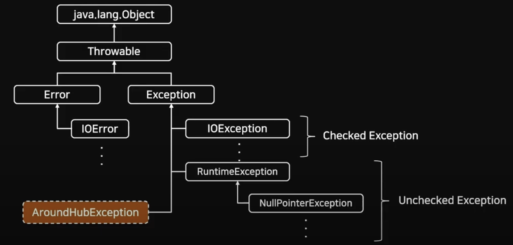
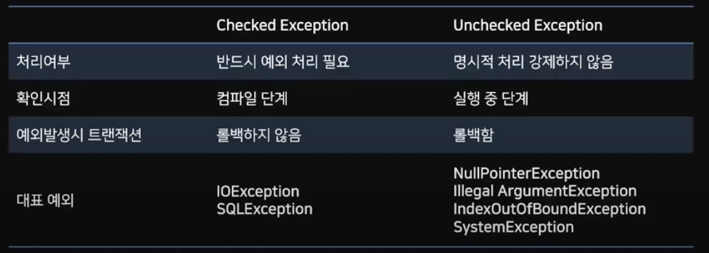
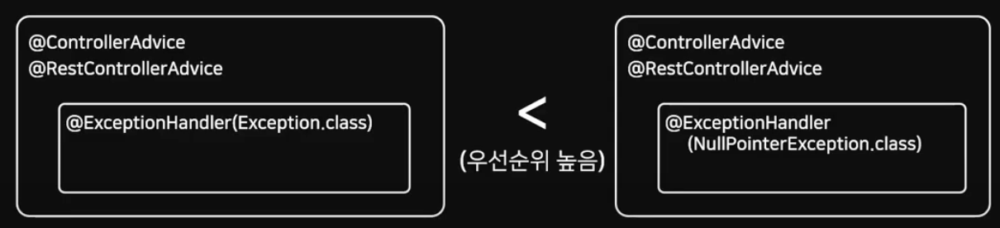

# [예외 처리(Exception)](https://velog.io/@kiiiyeon/%EC%8A%A4%ED%94%84%EB%A7%81-ExceptionHandler%EB%A5%BC-%ED%86%B5%ED%95%9C-%EC%98%88%EC%99%B8%EC%B2%98%EB%A6%AC)

---
## 예외 클래스
- 모든 예외 클래스는 Throwable 클래스를 상속 받고 있음



---

- RuntimeException은 Unchecked Exception이며, 그 외 Exception은 Checked Exception으로 볼 수 있음 



---
## 스프링 부트의 예외 처리 방식 
- @ControllerAdvice를 통한 모든 Controller에서 발생할 수 있는 예외 처리 
- @exceptionHandler를 통한 특정 Controller의 예외 처리 

`@ControllerAdvice`로 모든 컨트롤러에서 발생할 예외를 정의하고, `@ExceptionHandler`를 통해 발생하는 예외 마다 처리할 메소드를 정의 

---
### @ExceptionHandler
- @ExceptionHandler는 Controller계층에서 발생하는 에러를 잡아서 메서드로 처리해주는 기능이다.
- Service, Repository에서 발생하는 에러는 제외한다.

```java
@Controller
public class SimpleController {

    // ...

    @ExceptionHandler
    public ResponseEntity<String> handle(IOException ex) {
        // ...
    }
}
```

---
- 여러개의 Exception 처리 
  - @ExceptionHandler의 value 값으로 어떤 Exception을 처리할 것인지 넘겨줄 수 있는데,
value를 설정하지 않으면 모든 Exception을 잡게 되기 때문에 Exception을 구체적으로 적어주는 것이 좋다고 한다.

```java
@Controller
public class SimpleController {

    // ...

    @ExceptionHandler({FileSystemException.class, RemoteException.class})
    public ResponseEntity<String> handle(Exception ex) {
        // ...
    }
}
```

---
- 우선 순위
  - Exception.class보다 구체적인 오류클래스(NullPointerException.class)가 우선순위 높음 




---
### @ControllerAdvice
- @ControllerAdvice안에서 @ExceptionHandler를 사용하여 에러를 잡을 수 있다.

```java
@ControllerAdvice
public class ExceptionHandlers {

    @ExceptionHandler(FileNotFoundException.class)
    public ResponseEntity handleFileException() {
        return new ResponseEntity(HttpStatus.BAD_REQUEST);
    }

}
```

---

- 범위 설정 
  - @ControllerAdvice는 모든 에러를 잡아주기 때문에 일부 에러만 처리하고 싶을 경우에는 따로 설정을 해주면 된다.

```java
// 1.
@ControllerAdvice(annotations = RestController.class)
public class ExampleAdvice1 {}

// 2.
@ControllerAdvice("org.example.controllers")
public class ExampleAdvice2 {}

// 3.
@ControllerAdvice(assignableTypes = {ControllerInterface.class, AbstractController.class})
public class ExampleAdvice3 {}

```


---
### @RestControllerAdvice
- @RestControllerAdvice는 @ControllerAdvice와 @ResponseBody로 이루어져있어 오류 메세지를 Response body(즉, json)로 리턴할 수 있다.

```java
@Target(ElementType.TYPE)
@Retention(RetentionPolicy.RUNTIME)
@Documented
@ControllerAdvice
@ResponseBody
public @interface RestControllerAdvice {
	// ...	
}
```

---
# 소스
- https://github.com/Around-Hub-Studio/AroundHub_SpringBoot/tree/master

# 참고자료
- [1편](https://www.youtube.com/watch?v=7t6tQ4KV37g&t=498s)
- [2편](https://www.youtube.com/watch?v=1Jc-SD9YrV4)


