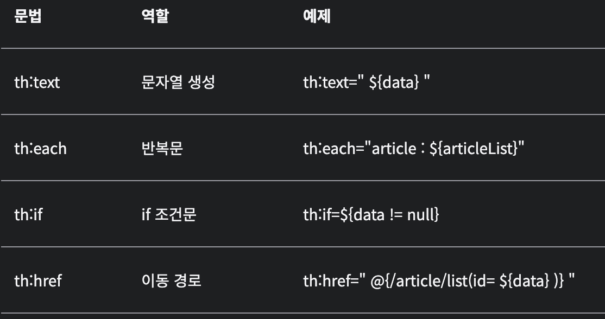

# [thymeleaf](https://www.thymeleaf.org/)
- [Spring guide](https://spring.io/guides/gs/serving-web-content/)
- [Thymeleaf Tutorial](https://www.thymeleaf.org/doc/tutorials/3.0/usingthymeleaf.html)

Thymeleaf는 웹 및 웹이 아닌 환경 모두에서 작동할 수 있는 Java XML/XHTML/HTML5 템플릿 엔진입니다.  
MVC 기반 웹 애플리케이션의 뷰 레이어에서 XML/XHTML/HTML5를 제공하는 데 더 적합하지만 오프라인 환경에서도 모든 XML파일을 처리할 수 있습니다. ( from 위키백과)

---
## 특징 
- 서버 사이드 HTML 렌더링(SSR)
  - 타임리프는 백엔드 서버에서 HTML을 동적으로 렌더링하는 용도로 사용 
- 네추럴 템플릿 
  - 타임리프는 순수한 HTML을 최대한 유지하려는 특징이 있음
- 스프링 통합 지원  
  - 타임리프는 스프링과 자연스럽게 통합되어 스프링의 다양한 기능을 쉽게 사용 

---
## 타임리프 설정 
- build.gradle

```
dependencies {
	implementation 'org.springframework.boot:spring-boot-starter-thymeleaf'
}
```
- application.yml

```yml
spring:
  thymeleaf:
    predix: classpath:templates/thymeleaf/
    check-template-location: true 
    suffix: .html
    mode: HTML
    cache: false # default true, 개발 시에는 false로 두는 것이 좋음 
```

---
## 타임리프를 적용한 HTML 

```html
<!DOCTYPE html>

<html xmlns:th="http://www.thymeleaf.org">

<head>
  <meta charset="UTF-8">
  <title>Title</title>
</head>
<body>

</body>
</html>
```

---
## 자주 사용하는 타임리프 문법 


---
- 타임리프에서 a태그를 작성할 때 예제들 

```html
<!-- 특정 url로 이동 -->
<a th:href="@{https://developer-rooney.tistory.com}">글 상세보기</a>

<!-- 현재 서버 내에서 이동 -->
<a th:href="@{/board/list}">게시글 리스트</a>

<!-- 파라미터를 넘길 시 -->
<a th:href="@{/board/view(id = ${board.id})}">글 상세보기</a>

<!-- 파라미터를 여러 개 넘길 시 -->
<a th:href="@{/board/view(id = ${board.id}, writer = ${board.writer}})}">글 상세보기</a>

<!-- PathVariable 사용 시 -->
<a th:href="@{/board/view/{id}(id = ${board.id})}">글 상세보기</a>
```


---
# 참고문서
- https://www.youtube.com/playlist?list=PLPtc9qD1979DG675XufGs0-gBeb2mrona
- https://github.com/isaackimdev/spring-boot-examples/tree/main/2.x/spring-boot-thymeleaf