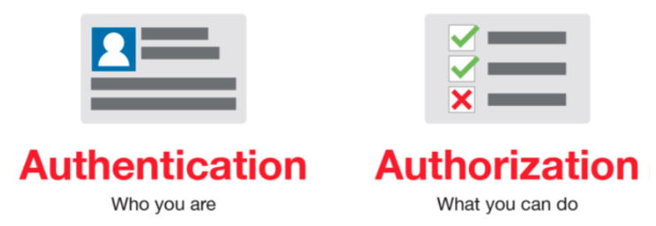
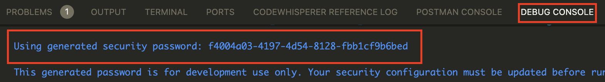
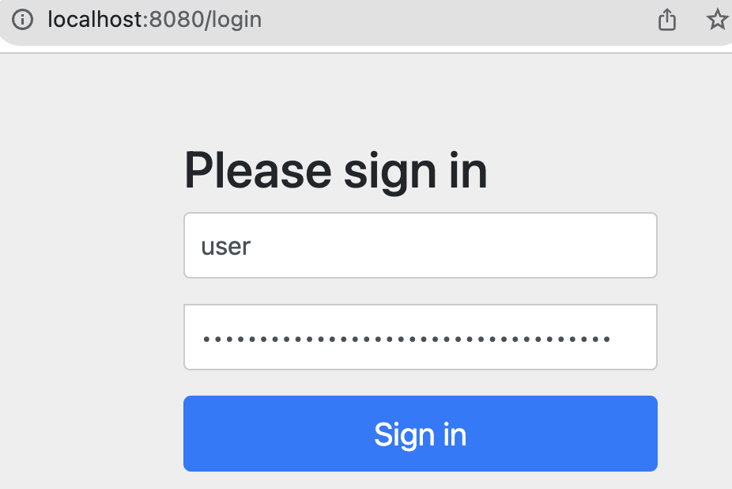
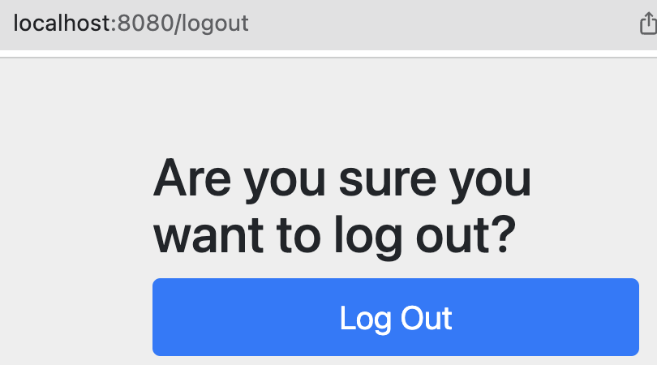

# [인증(Authorization)과 인가(Authentication)](https://velog.io/@djaxornwkd12/%EC%9D%B8%EC%A6%9DAuthentication%EC%9D%B8%EA%B0%80Authorization%EB%9E%80-%EB%AC%B4%EC%97%87%EC%9D%B8%EA%B0%80)
- 인증(Authorization)
  - 해당 사용자가 본인이 맞는지를 확인하는 절차
- 인가(Authorization)
  - 인증된 사용자가 요청한 자원에 접근 가능한지를 결정하는 절차 



---

# [Spring Security](https://nahwasa.com/entry/%EC%8A%A4%ED%94%84%EB%A7%81%EB%B6%80%ED%8A%B8-30%EC%9D%B4%EC%83%81-Spring-Security-%EA%B8%B0%EB%B3%B8-%EC%84%B8%ED%8C%85-%EC%8A%A4%ED%94%84%EB%A7%81-%EC%8B%9C%ED%81%90%EB%A6%AC%ED%8B%B0)
- Spring Security는 Spring 기반의 `애플리케이션의 보안(인증과 권한, 인가 등)을 담당하는 스프링 하위 프레임워크`이다. 
- Spring Security는 `인증과 권한에 대한 부분을 Filter 흐름에 따라 처리`하고 있다. 
- Spring Security는 보안과 관련해서 쳬계적으로 많은 옵션을 제공해주기 때문에 개발자 입장에서 일일이 보안관련 로직을 작성하지 않아도 된다는 장점이 있다. 

---
## 초기 화면 및 비번 

---
### 초기 보안 비밀번호 확인 


---
### 초기 로그인 화면


---
### 초기 로그아웃 화면 


---
## Spring Security Configuration(스프링 보안 설정)

---
## [Configuration Migrations](https://docs.spring.io/spring-security/reference/migration-7/configuration.html#_use_the_lambda_dsl)

---

```java
@Configuration
@EnableWebSecurity
public class SecurityConfig {

    @Bean
    public SecurityFilterChain filterChain(HttpSecurity http) throws Exception {
        http
            .authorizeHttpRequests(authorize -> authorize
                .requestMatchers("/blog/**").permitAll() // 로그인 없이 접근 가능 
                .anyRequest().authenticated() // 그 외 요청은 로그인 없이 접근 불가 
            )
            .formLogin(formLogin -> formLogin
                .loginPage("/login") // 로그인 페이지 접근 가능 
                .permitAll()
            )
            .rememberMe(Customizer.withDefaults());

        return http.build();
    }
}
```

---

```java
@Configuration
@EnableWebSecurity
public class SecurityConfig {

  @Bean
  public SecurityFilterChain filterChain(HttpSecurity http) throws Exception {
    http
      .authorizeHttpRequests(authorize -> authorize
        .requestMatchers("/user/**").authenticated() // 로그인 없이 접근 불가 
        .requestMatchers("/manager/**").hasAnyRole("ADMIN", "MANAGER") // 권한 없이 접근 불가
        .requestMatchers("/admin/**").hasAnyRole("ADMIN") // 권한 없이 접근 불가 
        .anyRequest().permitAll() // 그외 접근 가능 
      )
      .formLogin(formLogin -> formLogin
        .loginPage("/login") // 로그인 화면 접근 가능 
        .permitAll()
      );

    return http.build();
  }
}
```


---
## [Spring Security without the WebSecurityConfigurerAdapter](https://spring.io/blog/2022/02/21/spring-security-without-the-websecurityconfigureradapter)

---
### Configuring HttpSecurity
```java
@Configuration
public class SecurityConfiguration {

    @Bean
    public SecurityFilterChain filterChain(HttpSecurity http) throws Exception {
        http
            .authorizeHttpRequests((authz) -> authz
                .anyRequest().authenticated()
            )
            .httpBasic(withDefaults());
        return http.build();
    }

}
```

---
### Configuring WebSecurity
```java
@Configuration
public class SecurityConfiguration {

    @Bean
    public WebSecurityCustomizer webSecurityCustomizer() {
        return (web) -> web.ignoring().antMatchers("/ignore1", "/ignore2");
    }

}
```

---

# logging
- @Slf4j
