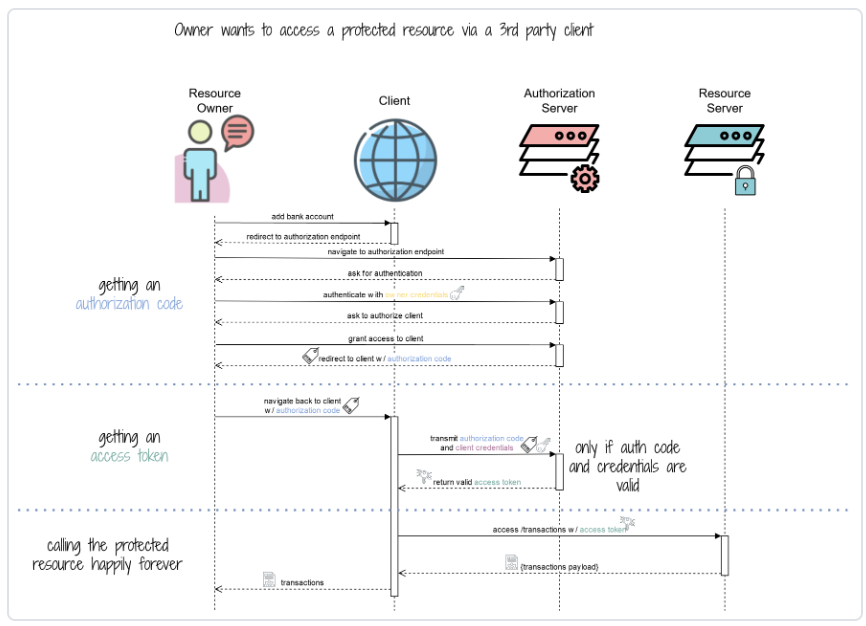
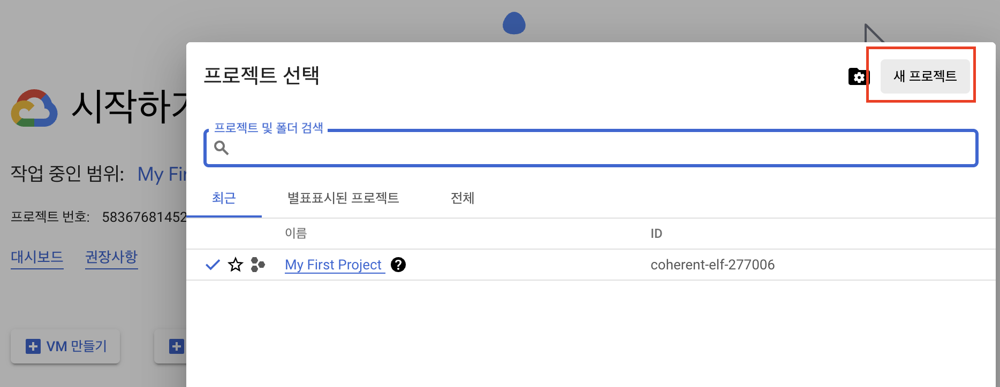
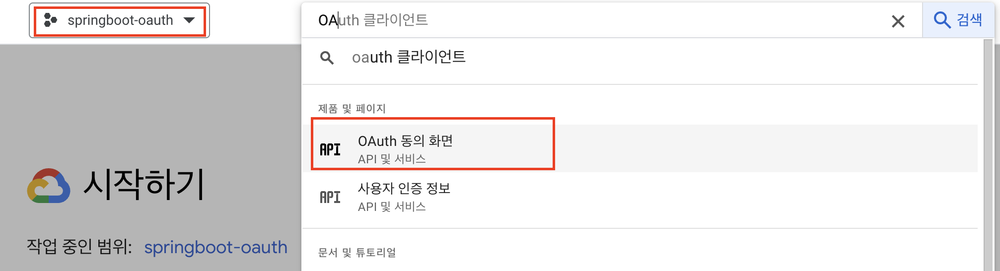
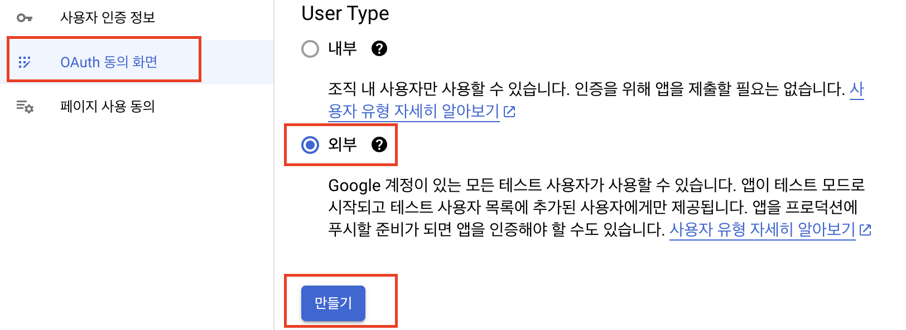
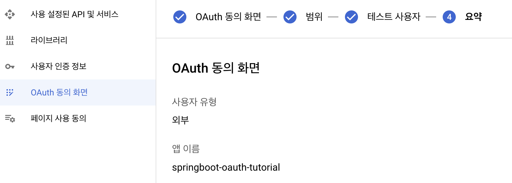
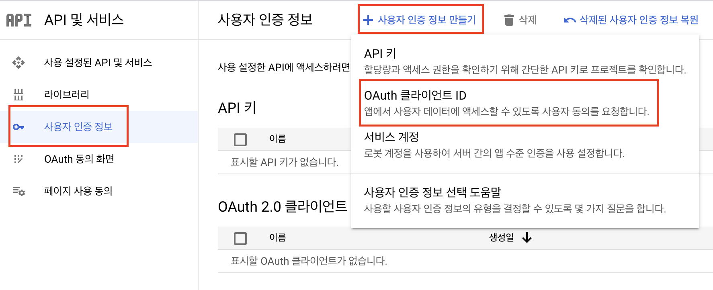
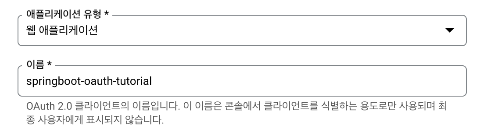
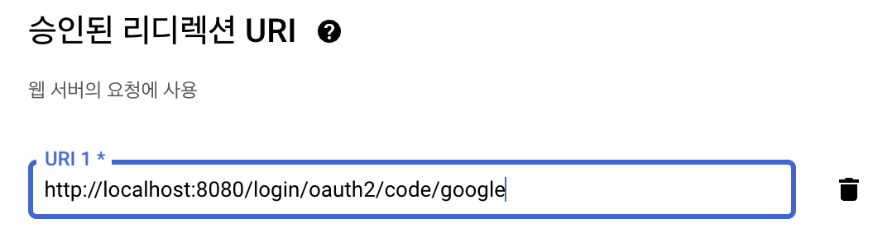
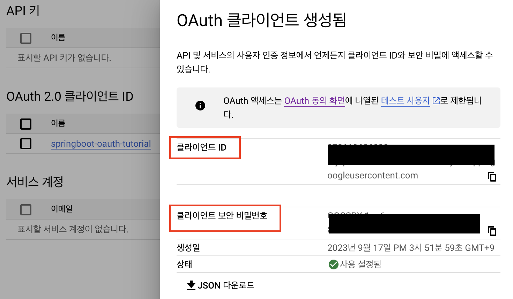

# [OAuth2.0](https://junuuu.tistory.com/405?category=1014988)
- OAuth란 Open Authorization의 약자로 다양한 플랫폼 환경에서 권한 부여를 위한 산업 표준 프로토콜입니다.
- 제3의 애플리케이션이 자원의 소유자인 서비스 이용자를 대신하여 서비스(구글, 네이버, 카카오 등)를 요청할 수 있도록 접근 권한을 위임하는 방법 
  - 어떤 서비스를 이용할 때 페이스북이나 구글 아이디로 회원가입이 가능한 것 경우

---
## [OAuth2 Login Flow](https://www.marcobehler.com/guides/spring-security-oauth2)

---
# Google OAuth
- [Google API 프로젝트 삭제 방법](https://wildeveloperetrain.tistory.com/153)

---
## [Google API Console](https://console.cloud.google.com/)
1. Google API Console에서 프로젝트 생성 

---
2. OAuth 동의 화면 
- 생성한 프로젝트 이동 -> OAuth 동의 화면 이동 

---
- User Type을 외부로 선택 후 만들기 

---
- 결과 화면 

---
3. 사용자 인증 정보 -> 사용자 인증 정보 만들기 

---
- OAuth 클라이어트ID 만들기 -> 입력 

---
- OAuth 클라이어트ID 만들기 -> 입력 
  - 도메인 주소 + `/login/oauth2/code/` + OAuth 서버명 
    - 예) `http://localhost:8080/login/oauth2/code/google`

---

---
# logging
- @Slf4j

# 참고문서
- https://www.youtube.com/watch?v=nVCEJv6eA-w&list=PL93mKxaRDidERCyMaobSLkvSPzYtIk0Ah&index=8
