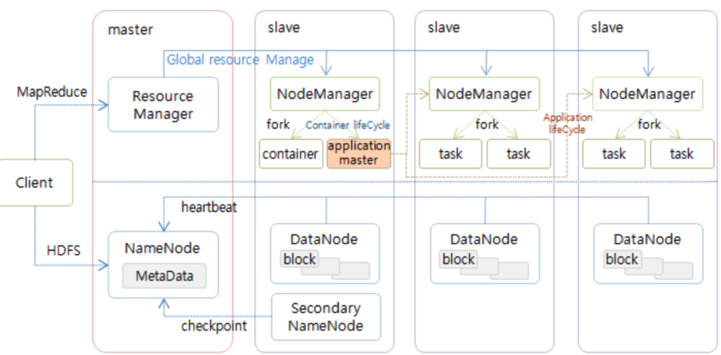

# Hadoop
- 하둡(Hadoop)이란 고가용성 분산형 객체 지향적 플랫폼(High Availability Distributed Object Oriented Platform)을 뜻합니다. 
- 하둡 기술은 바로 이런 장점을 개발자에게 제공합니다. 즉, 객체 지향적 작업을 병렬 분산하여 고가용성을 확보할 수 있습니다.

---
# [코어 하둡 모듈](https://www.databricks.com/kr/glossary/hadoop) 

- `HDFS(Hadoop Distributed File System)`: HDFS는 Java 기반 시스템의 일종으로, 클러스터 내 여러 노드에 걸쳐 대규모 데이터 세트를 내결함성 있는 방식으로 저장할 수 있게 해줍니다.
- `YARN(Yet Another Resource Negotiator)`: YARN은 클러스터 리소스 관리, 작업 계획, 그리고 하둡에서 실행되는 작업 예약에 쓰입니다.
- `MapReduce`: MapReduce는 프로그래밍 모델 겸 대규모 데이터 세트의 병렬식 처리를 위해 쓰이는 빅데이터 처리 엔진입니다. 
- `Hadoop Common`: Hadoop Common은 다른 Hadoop 모듈을 지원하는 여러 라이브러리와 유틸리티를 총망라한 일련의 서비스를 제공합니다.

---

---
# [하둡 아키텍처](https://velog.io/@ha0kim/2021-03-02)

---
- `HDFS`의 경우 마스터를 네임노드라 부르고 슬레이브를 데이터노드라고 한다.
- `MapReduce`의 경우 마스터를 리소스매니저라고 부르고 슬레이브를 노드매니저라고 부른다.
- `MapReduce`프로그램을 실행하면 리소스매니저가 노드매니저에 일을 나눠주어 병렬로 실행하는 형태로 진행한다.
- `MapReduce`프로그램은 처리할 입력데이터를 `HDFS`에서 읽어들이고 처리된 데이터를 다시 `HDFS`에 출력한다.
- `HDFS`자체는 혼자서 독립적으로 분산파일시스템으로 쓰일 수 있지만 `MapReduce`프레임워크는 HDFS를 데이터 읽기/쓰기를 위해 필요하다.

---
## [Multi Layer 구조]((https://mangkyu.tistory.com/129) ) 
- Hadoop에서 수행하는 역할은 크게 HDFS에 파일을 저장하는 역할과 데이터를 처리하는 역할로 나누어진다.

---
- MapReduce Layer: MapReduce를 수행하기 위한 Layer 
    - Job Tracker: 사용자로부터 Job을 요청 받고 Task Tracker에 작업 할당 
    - Task Tracker: Job Tracker로부터 할당 받은 작업을 Map-Reduce하여 결과 반환 
- HDFS Layer: 파일을 저장하기 위한 Layer
    - Name Node: 작업을 해야 하는 파일을 Block으로 나누어 Data Node에 전달 
    - Data Node: 전달받은 파일의 읽기/쓰기 등을 실제로 수행 

---
## [Master-Slave 구조]((https://mangkyu.tistory.com/129) ) 
- Hadoop은 기본적으로 Master Slave 구조를 지니며, Master 노드는 1대, Slave 노드는 N대로 구성된다. 

---
- Master Node: DFS(Distributed File System, 분산파일 시스템)에 대한 정보들을 지니고 있으며, 자원 할당을 조절한다. Master Node는 2가지 Daemon을 통해 이를 처리한다. 
    - Name Node: DFS를 관리하고, 어떤 Data Block이 클러스터에 저장되어 있는지 알려준다. 
    - Resource Manager: 스케줄링 및 Slave Node의 처리를 실행한다. 
- Slave Node는 실제 데이터를 가지고 있으며, job을 수행하는데 Data Node와 Node Manager를 통해 이를 처리한다. 
    - Data Node: Name Node에 물리적으로 저장된 실제 데이터를 관리한다. 
    - Node Manager: 노드이 Task를 실행한다. 

---
## Block 구조 
- Hadoop은 분산 파일 시스템인 HDFS(Hadoop Distributed File System)에 데이터를 저장하여 처리한다. 
- Hadoop은 파일을 Block(블록)이라는 단위로 나누어 관리하는데, 1개의 파일은 여러 개의 블록으로 나뉘어 여러 Node에 Replication(복제)된다.

---
- 예를 들어 1번 Node에만 Block 1이 저장되었다고 할 때, Node1이 고장나면 Node1에 저장된 Block1을 구할 수 없다. 하지만 Block1을 Node2에도 복제하면 Node1이 작동하지 않을 때에도 Node2로부터 Block1에 대한 정보를 얻을 수 있다. 
- 이러한 Node Failure에 대응하기 위해 Hadoop은 하나의 블록을 여러 개의 Node에 복제하고 있다. 

---
# 하둡 이론 참고 문서 
- https://velog.io/@ha0kim/2021-03-02
- https://www.databricks.com/kr/glossary/hadoop
- https://wikidocs.net/22654
- https://han-py.tistory.com/361
- https://dataonair.or.kr/db-tech-reference/d-lounge/technical-data/?mod=document&uid=236860
- https://warm-uk.tistory.com/56
- https://sodayeong.tistory.com/29
- https://mangkyu.tistory.com/129
- https://dydwnsekd.tistory.com/3

---
# 예제
- https://blog.naver.com/PostView.naver?blogId=dkdldoafotn&logNo=221692119047&categoryNo=16&parentCategoryNo=0&viewDate=&currentPage=1&postListTopCurrentPage=1&from=search&userTopListOpen=true&userTopListCount=5&userTopListManageOpen=false&userTopListCurrentPage=1
- https://kadensungbincho.tistory.com/45
- https://so-easy-coding.tistory.com/21
- https://zeuskwon-ds.tistory.com/68
- https://velog.io/@cattmerry/Hadoop-ecosystem-Docker-container%EB%A1%9C-%EA%B5%AC%EC%B6%95%ED%95%B4%EB%B3%B4%EA%B8%B0-2

- https://dev-listener.medium.com/docker-compose-for-apache-hadoop-hdfs-d949150f745a
- https://www.section.io/engineering-education/set-up-containerize-and-test-a-single-hadoop-cluster-using-docker-and-docker-compose/
- https://hjben.github.io/hadoop-cluster/
- https://medium.com/@ayyoubmaulana/developing-multi-nodes-hadoop-spark-cluster-and-airflow-in-docker-compose-part-1-10331e1e71b3
- https://github.com/big-data-europe/docker-hadoop/blob/master/docker-compose.yml

