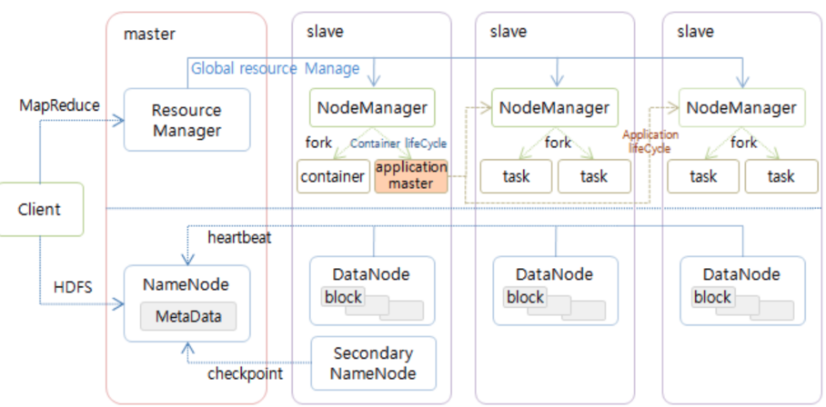

# [하둡 아키텍처](https://velog.io/@ha0kim/2021-03-02)

---
- `HDFS`의 경우 마스터를 네임노드라 부르고 슬레이브를 데이터노드라고 한다.
- `MapReduce`의 경우 마스터를 리소스매니저라고 부르고 슬레이브를 노드매니저라고 부른다.
- `MapReduce`프로그램을 실행하면 리소스매니저가 노드매니저에 일을 나눠주어 병렬로 실행하는 형태로 진행한다.
- `MapReduce`프로그램은 처리할 입력데이터를 `HDFS`에서 읽어들이고 처리된 데이터를 다시 `HDFS`에 출력한다.
- `HDFS`자체는 혼자서 독립적으로 분산파일시스템으로 쓰일 수 있지만 `MapReduce`프레임워크는 HDFS를 데이터 읽기/쓰기를 위해 필요하다.

---
