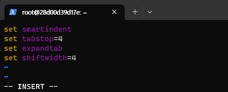
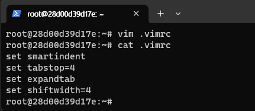
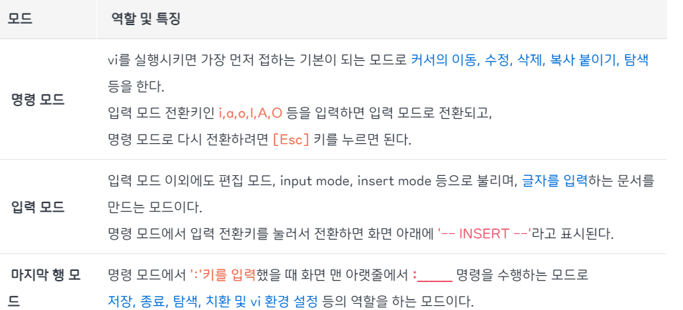
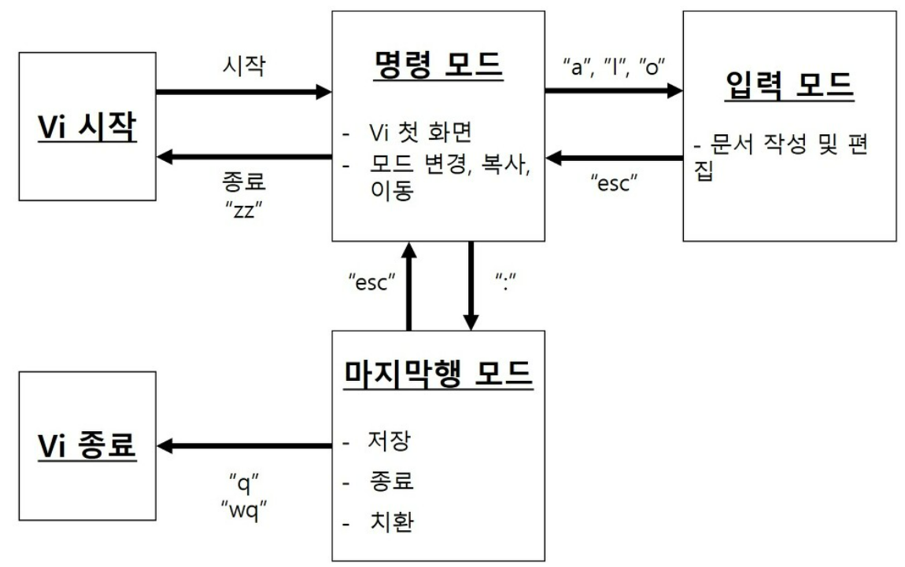
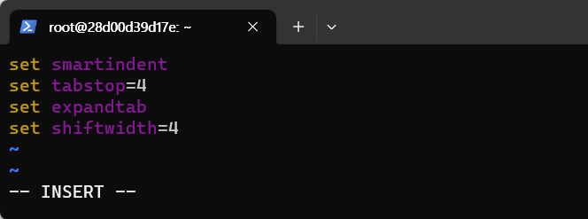
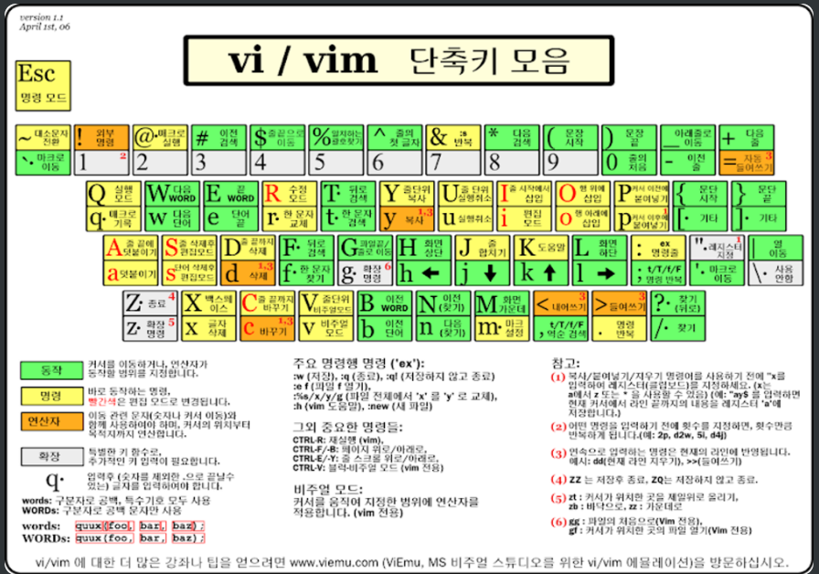
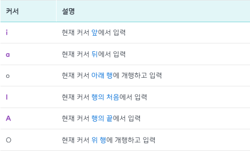
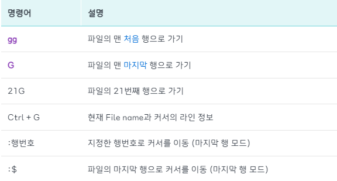
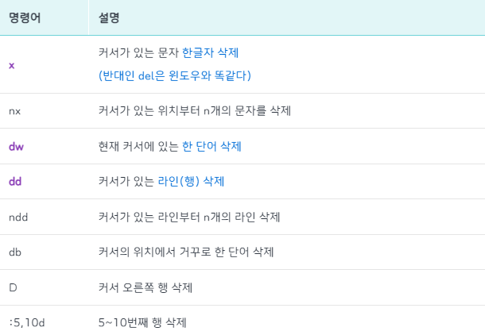
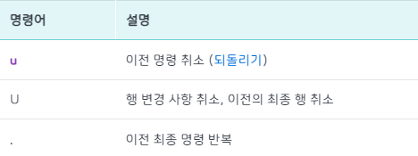

# [Vim](https://inpa.tistory.com/entry/LINUX-%F0%9F%93%9A-Vi-Vim-%EC%97%90%EB%94%94%ED%84%B0-%EB%8B%A4%EB%A3%A8%EA%B8%B0-%EB%AA%85%EB%A0%B9%EC%96%B4-%F0%9F%92%AF-%EC%A0%95%EB%A6%AC) 

---
## [Vim 설치방법](https://happy-jjang-a.tistory.com/167) 
```shell
apt-get update
```

```shell
apt-get install vim
```


---
## Vim 환경 설정 
```shell
cd ~ # 사용자 홈으로 이동한다.
vim .vimrc # vim 환경설정 파일을 만든다.
```


---
```shell
1. i를 눌러 쓰기 모드로 변경한다.
2. 아래 코드를 작성한다. (기본적으로 tab에 대한 설정을 하는 것이 좋다.)
3. 작성이 완료되면, ESC를 누르고, :wq!를 치고 엔터를 누른다. 
```

```shell
cat .vimrc # vim 환결설정 내용 확인 
```


---
## Vim 3가지 모드 
- vi 편집기는 명령모드, 입력모드, 마지막 행 모드로 총 3가지 모드로 구성되어있다. 



---


---
### 입력모드 


### 마지막행 모드 


---
## Vim 명령어 


---
### 입력모드 


---
### 라인 이동 


---
### 내용 변경 


---
### 내용 삭제 


---
### 내용 되돌리기 


### vim 행 번호 표시 


---
### 검색 


---
### 저장 및 종료 


---
# 참고문서 
- https://inpa.tistory.com/entry/LINUX-%F0%9F%93%9A-Vi-Vim-%EC%97%90%EB%94%94%ED%84%B0-%EB%8B%A4%EB%A3%A8%EA%B8%B0-%EB%AA%85%EB%A0%B9%EC%96%B4-%F0%9F%92%AF-%EC%A0%95%EB%A6%AC
- https://80000coding.oopy.io/2ba378ee-3bb5-4de1-8a3f-b44c899cccce